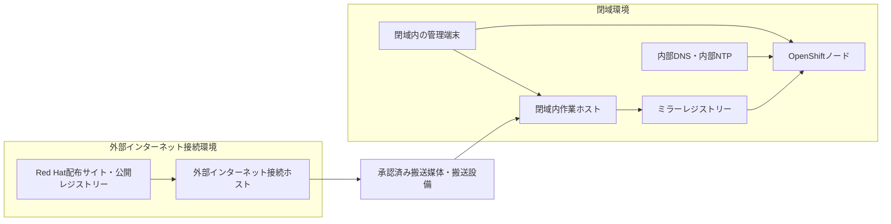

# OpenShift Container Platform 4.21 Agent-based Installer 閉域インストール手順書

本手順書では、Agent-based Installerを使用して、完全閉域環境へOpenShiftを導入する手順を示す。  
主な手順は以下の通りである。まず、外部インターネット接続環境でOpenShiftの導入に必要なプログラムとイメージを取得し、閉域内のミラーレジストリーへ格納する。その後、クラスター設定を組み込んだAgent ISOを閉域内で作成し、OpenShiftのクラスタに参加するノードをこのISOから起動する。最後に、OpenShiftのインストール完了を確認する。

> [!NOTE]
> **注釈**  
> 本手順書では、手順を一通り実行できるようなサンプル構成として、閉域内作業ホストにDNS、NTP、ミラーレジストリーを同居させる構成を扱う。各IPアドレス、FQDN、ホスト名、ネットワーク範囲等はサンプル値であり、実環境の場合は設計値へ置き換える。 また本番環境では、既設のDNSとNTPの利用や、可用性要件を満たすミラーレジストリーの設計を検討する。

## 目次

- [第I部　OpenShiftのインストール方式、構成、要件](#part-1)
  - [1. Agent-based Installer方式と作業の流れ](#section-1)
  - [2. クラスター構成と事前要件](#section-2)
- [第II部　Agent-based Installerを使用したオフラインインストール手順](#part-2)
  - [3. 外部インターネット接続ホストでの資材準備](#section-3)
  - [4. 資材の閉域搬入](#section-4)
  - [5. 閉域内作業ホストとミラーレジストリーの準備](#section-5)
  - [6. install-config.yamlの作成](#section-6)
  - [7. agent-config.yamlの作成](#section-7)
  - [8. Agent ISOの作成](#section-8)
  - [9. ノードの起動とインストールの確認](#section-9)
- [参考資料](#references)


# 第I部　OpenShiftのインストール方式、構成、要件

第I部では、実際のインストール手順を紹介する前に、Agent-based Installerの動作、OpenShiftのクラスター構成、ネットワーク、DNS、NTP、通信、ミラーレジストリーなどの要件を整理する。


## 1. Agent-based Installer方式と作業の流れ

本章では、OpenShiftの主なインストール方式を比較し、Agent-based Installerで閉域クラスターを構築する際の手順の全体像を確認する。

### 1.1 OpenShiftの主なインストール方式

ここでは、主なOpenShiftのインストール方式を整理する。

**表1-1　主なOpenShiftのインストール方式**


| 方式                                        | 概要                                                                                                                                        | 主な利用場面                                                     |
| ----------------------------------------- | ----------------------------------------------------------------------------------------------------------------------------------------- | ---------------------------------------------------------- |
| IPI（Installer-provisioned infrastructure） | Installerで、対応基盤のサーバー、ネットワーク、ロードバランサー、bootstrapノードなどを作成・設定し、OpenShiftの導入まで進める。DNSなど一部の設定も、対応する基盤ではInstallerが自動で行う。基盤構築を含めて自動化できるため、手順がシンプル | 対応するクラウドやオンプレミス基盤で、基盤構築を含めて自動化し、導入作業を簡素化したい場合              |
| UPI（User-provisioned infrastructure）      | InstallerでOpenShiftの設定を作成し、サーバー、ネットワーク、ロードバランサー、DNS、bootstrapノードなどの基盤は利用者側で準備する。IPIより作業量は増えるが、基盤構成のカスタマイズ性が高い                             | 対応するクラウドやオンプレミス基盤で、既存基盤を利用する場合や、組織の要件に合わせて基盤を個別に設計・管理したい場合 |
| Assisted Installer                        | Red Hatが提供するHosted ServiceをWeb画面から利用し、Discovery ISOを作成して各ノードを起動する。専用の一時bootstrapノードは不要で、対話形式で導入を進められるため手順をシンプルにしやすい                       | インターネットへ接続できるオンプレミス環境で、Web画面を使って対話形式で簡単に導入したい場合。SNOにも対応する  |
| Agent-based Installer                     | Installerと設定YAMLを使用してCLIでAgent ISOを作成し、そのISOから各ノードを起動する。専用の一時bootstrapノードは不要で、設定をファイルで管理しながら完全閉域環境でも導入できる                                 | インターネットへ接続できないオンプレミスの閉域環境で、OpenShiftを導入したい場合。SNOにも対応する     |


本手順書では、オンプレ閉域内のInstallerやOpenShiftクラスターが外部への接続を行わない環境を想定し、Agent-based Installerによるインストールの手順を示す。

### 1.2 Agent-based Installerの動作

Agent-based Installerを用いたインストールでは、クラスター全体の設定と各ノードの設定を組み込んだAgent ISOを作成する。Agent ISOには、ノードを検出するAssisted discovery agentと、初期構築を調整するAssisted Serviceが含まれる。

各OpenShiftノードを同じAgent ISOから起動するとAgentが動作し、設定に従ってOpenShift専用OSであるRed Hat Enterprise Linux CoreOS（RHCOS）を指定したディスクへインストールする。  
管理プレーン（control plane）のうち指定した1台がrendezvous host（ランデブーホスト）となり、Assisted Serviceを動作させて、ほかのノードと連携しながらクラスターの初期構築を進める。ランデブーホストは初期構築中にbootstrapの役割も担い、クラスター成立後は通常のcontrol planeとして動作する。

OpenShiftクラスターのインストール中は、各OpenShiftノードが必要なOCPリリースイメージを閉域内のミラーレジストリーから取得する。このため、ノードをAgent ISOから起動する前に、OCPリリースイメージをミラーレジストリーへ登録しておく。

OpenShiftへログ、バックアップ、仮想化などの追加機能を導入・更新する仕組みをOperatorと呼ぶ。この機能を使用する場合は、そのカタログや関連イメージもあわせてミラーレジストリーへ登録しておく。

### 1.3 構成要素と配置

ここでは、外部インターネット接続環境から閉域環境へ資材を運ぶ経路と、閉域内で利用するホストおよびサービスの配置を確認する。




実際の環境では、閉域内作業ホスト、ミラーレジストリー、DNS、NTPは要件に応じて分離する。本手順の構成では、これらを1台の閉域内作業ホストへ同居させる。

次の表は、本手順における各ホストの配置と役割を示す。

**表1-2　構成要素の役割**


| 構成要素           | 配置            | 役割                                                                                |
| -------------- | ------------- | --------------------------------------------------------------------------------- |
| 外部インターネット接続ホスト | 外部インターネット接続環境 | インターネットへ接続し、OpenShift CLI、ISO作成プログラム、イメージ搬送プログラム、認証情報、OCPリリース、Operatorイメージなどを取得する |
| 搬送媒体または搬送設備    | 閉域境界          | 外部インターネット接続ホストで準備したファイルを閉域へ受け渡す                                                   |
| 閉域内作業ホスト       | 閉域環境          | ファイルの搬入確認、イメージ登録、設定ファイル作成、Agent ISO作成、インストールの監視を行う                                |
| ミラーレジストリー      | 閉域環境          | OCPリリース、Operator、追加イメージを保管し、OpenShiftノードへ配信する                                     |
| 内部DNS／内部NTP    | 閉域環境          | OpenShift用の名前解決と全ノードの時刻同期を提供する                                                    |
| OpenShiftノード   | 閉域環境          | 定義したクラスター構成に従い、control planeまたはworkerとして動作する                                      |


### 1.4 Agent-based Installerを用いた閉域インストールの手順概要

第II部で行う手順と、各手順で参照するRed Hat公式資料の対応を次に示す。

**表1-3　インストール手順と参照資料**


| 手順  | 作業概要                                                                                                                              | 主な参照資料                                                                                                                                                                                                                                                                                                                                                                                                                                                                                                                                                                   |
| --- | --------------------------------------------------------------------------------------------------------------------------------- | ------------------------------------------------------------------------------------------------------------------------------------------------------------------------------------------------------------------------------------------------------------------------------------------------------------------------------------------------------------------------------------------------------------------------------------------------------------------------------------------------------------------------------------------------------------------------ |
| 1   | クラスター構成、ネットワーク、通信許可、DNS、NTP、ミラーレジストリーを事前に設計し、設定を完了する。                                                                             | [Agent-based Installer を使用したオンプレミスクラスターのインストール：第1章「Agent-based Installer を使用したインストールの準備」（1.1「Agent-based Installer について」、1.4「ホストの設定」、1.5「ネットワークの概要」、1.6「プラットフォーム "none" オプションを使用するクラスターの要件」）](https://docs.redhat.com/ja/documentation/openshift_container_platform/4.21/html-single/installing_an_on-premise_cluster_with_the_agent-based_installer/index)、[インストール設定：第2章「ファイアウォールの設定」（2.1「OpenShift Container Platform のファイアウォールの設定」）](https://docs.redhat.com/ja/documentation/openshift_container_platform/4.21/html/installation_configuration/configuring-firewall) |
| 2   | 外部インターネット接続ホストで、OpenShift CLI、Installer、`oc-mirror`、Pull secretを準備する。Pull secretとは、Red Hat公開レジストリーからイメージを取得するためのJSON形式の認証ファイルである。 | [Agent-based Installer を使用したオンプレミスクラスターのインストール：第3章「クラスターのインストール」（3.2「Agent-based Installer のダウンロード」）](https://docs.redhat.com/ja/documentation/openshift_container_platform/4.21/html-single/installing_an_on-premise_cluster_with_the_agent-based_installer/index)、[非接続環境：第6章「oc-mirror プラグイン v2 を使用した非接続インストールのイメージのミラーリング」（6.3「前提条件」）](https://docs.redhat.com/ja/documentation/openshift_container_platform/4.21/observability/disconnected_environments/about-installing-oc-mirror-v2)                                                                              |
| 3   | 取得するOCPリリース、Operator、追加イメージをImageSetConfigurationへ記載する。                                                                           | [非接続環境：第6章「oc-mirror プラグイン v2 を使用した非接続インストールのイメージのミラーリング」（6.5.2「イメージセット設定の作成」、6.13「oc-mirror プラグイン v2 の ImageSet 設定パラメーター」）](https://docs.redhat.com/ja/documentation/openshift_container_platform/4.21/observability/disconnected_environments/about-installing-oc-mirror-v2)                                                                                                                                                                                                                                                                                           |
| 4   | `oc-mirror`のmirror-to-disk処理を実行し、公開レジストリーのイメージを閉域搬送用の`mirror_*.tar`へ保存する。                                                         | [非接続環境：第6章「oc-mirror プラグイン v2 を使用した非接続インストールのイメージのミラーリング」（6.5.5.2「ミラーからディスクへのミラーリング」）](https://docs.redhat.com/ja/documentation/openshift_container_platform/4.21/observability/disconnected_environments/about-installing-oc-mirror-v2)                                                                                                                                                                                                                                                                                                                                 |
| 5   | 搬送媒体を通して、プログラム、認証情報、設定ファイル、`oc-mirror`の作業ディレクトリー全体を閉域へ搬入する。                                                                       | [非接続環境：第6章「oc-mirror プラグイン v2 を使用した非接続インストールのイメージのミラーリング」（6.5.5「完全な非接続環境でのイメージセットのミラーリング」）](https://docs.redhat.com/ja/documentation/openshift_container_platform/4.21/observability/disconnected_environments/about-installing-oc-mirror-v2)                                                                                                                                                                                                                                                                                                                            |
| 6   | 閉域内でミラーレジストリーを用意し、disk-to-mirror処理で搬入したイメージを登録する。                                                                                 | [非接続環境：第5章「mirror registry for Red Hat OpenShift を使用したミラーレジストリーの作成」](https://docs.redhat.com/ja/documentation/openshift_container_platform/4.21/html/disconnected_environments/installing-mirroring-creating-registry)、[非接続環境：第6章「oc-mirror プラグイン v2 を使用した非接続インストールのイメージのミラーリング」（6.5.5.3「ディスクからミラーへのミラーリング」）](https://docs.redhat.com/ja/documentation/openshift_container_platform/4.21/observability/disconnected_environments/about-installing-oc-mirror-v2)                                                                                                          |
| 7   | `install-config.yaml`と`agent-config.yaml`を作成する。                                                                                   | [Agent-based Installer を使用したオンプレミスクラスターのインストール：第3章「クラスターのインストール」（3.3「設定入力の作成」）](https://docs.redhat.com/ja/documentation/openshift_container_platform/4.21/html-single/installing_an_on-premise_cluster_with_the_agent-based_installer/index)、[第9章「Agent-based Installer のインストール設定パラメーター」（9.1「使用可能なインストール設定パラメーター」、9.2「使用可能なエージェント設定パラメーター」）](https://docs.redhat.com/ja/documentation/openshift_container_platform/4.21/html/installing_an_on-premise_cluster_with_the_agent-based_installer/installation-config-parameters-agent)                                      |
| 8   | 2つのYAMLからAgent ISOを作成し、同じISOから全OpenShiftノードを起動する。                                                                                 | [Agent-based Installer を使用したオンプレミスクラスターのインストール：第3章「クラスターのインストール」（3.4「エージェントイメージの作成と起動」、3.5「現在のインストールホストがリリースイメージをプルできることを確認する」）](https://docs.redhat.com/ja/documentation/openshift_container_platform/4.21/html-single/installing_an_on-premise_cluster_with_the_agent-based_installer/index)                                                                                                                                                                                                                                                                           |
| 9   | OpenShiftクラスターのインストール完了を待ち、ノード、ClusterOperator、管理接続を確認する。                                                                         | [Agent-based Installer を使用したオンプレミスクラスターのインストール：第3章「クラスターのインストール」（3.6「インストールの進行状況の追跡と確認」、3.7「失敗したエージェントベースのインストールからログデータを収集する」）](https://docs.redhat.com/ja/documentation/openshift_container_platform/4.21/html-single/installing_an_on-premise_cluster_with_the_agent-based_installer/index)                                                                                                                                                                                                                                                                            |


**本章の参照資料**

- [インストールの概要：第1章「OpenShift Container Platform インストールの概要」（1.1「OpenShift Container Platform のインストール」、1.1.4「インストールプロセス」）](https://docs.redhat.com/ja/documentation/openshift_container_platform/4.21/html-single/installation_overview/index)
- [Agent-based Installer を使用したオンプレミスクラスターのインストール：第1章「Agent-based Installer を使用したインストールの準備」（1.1「Agent-based Installer について」）](https://docs.redhat.com/ja/documentation/openshift_container_platform/4.21/html-single/installing_an_on-premise_cluster_with_the_agent-based_installer/index)
- [非接続環境：第1章「非接続環境について」（1.1「非接続環境に関する用語集」）](https://docs.redhat.com/ja/documentation/openshift_container_platform/4.21/html-single/disconnected_environments/index)


## 2. クラスター構成と事前要件

本章では、インストール前に確定するクラスター構成、OpenShiftノード、ネットワーク、通信、DNS、NTP、ミラーレジストリーの要件を示す。

### 2.1 クラスター構成を決める

まず、OpenShiftクラスターを何台のノードで構成し、それぞれのノードにどの役割を持たせるかを決める。本手順書では、標準クラスタ、3ノードクラスタ、SNOの3構成を扱う。

OpenShiftノードには、次の2つの役割がある。

- **control plane**：管理操作を受けるAPI、アプリケーションの実行先を決めるスケジューラー、クラスターの設定と状態を保存するetcdなどを実行する。
- **worker**：主に利用者のアプリケーションを実行する。

次の表は、本手順書で扱うクラスター構成とノードの役割を示す。

**表2-1　クラスター構成**


| 構成                         | ノード構成                                                                               |
| -------------------------- | ----------------------------------------------------------------------------------- |
| 標準クラスタ                     | control planeを3台用意し、必要数のworkerを追加する。本手順ではworker 2台を追加した5ノード構成を扱う                    |
| 3ノードクラスタ                   | 3台すべてがcontrol planeとしてクラスターを制御しながら、workerとして利用者ワークロードも実行する                          |
| Single-node OpenShift（SNO） | 1台のノードがcontrol planeとしてクラスターを制御しながら、workerとして利用者ワークロードも実行する。テスト環境や可用性を必要としない環境で利用する |


> [!NOTE]
> **注釈**  
> control planeは増設することができないため、control planeの可用性が必要な環境や、今後の拡張を見込む環境の場合は、SNOではなく、標準クラスターもしくは3ノードクラスターを採用する。


### 2.2 OpenShiftノードの要件を確認する

本項では、各OpenShiftノードへ割り当てるリソースと、Agent ISOを作成する前に確定する機器情報を整理する。

各ノードの推奨基準は8 vCPU、16 GiBメモリー、120 GBストレージである。  
実際の割当量には、採用するOperator、監視・ログ保持、利用者ワークロード、永続データに必要なリソースを加える。  
SNOでは制御機能、監視、ログ、利用者ワークロードが1台へ集約されるため、追加機能の必要量を個別に積み上げる。

各OpenShiftノードについて、Agent ISOの作成前に次を確定する。

- FQDN
- 固定IPアドレスとprefix length
- デフォルトゲートウェイ
- OpenShiftの通信用に使用するNIC名とMACアドレス
- RHCOSを書き込むディスク

外部インターネット接続ホストと閉域内作業ホストには、対象アーキテクチャーの`oc`、`openshift-install`、`oc-mirror`を実行できるRHEL 9系を使用する。本手順書ではx86_64環境を対象とする。ダウンロードするプログラムでは`x86_64`、OpenShiftの設定値では`amd64`という表記を使用する。

### 2.3 OpenShiftで使用するネットワークを決める

OpenShiftでは、ノード自身を接続するネットワークに加え、PodとServiceがクラスター内部で使用するネットワークを用意する。本項では、この3つのネットワークの用途とアドレス範囲を決める。

**表2-2　OpenShiftで使用するネットワーク**


| ネットワーク          | 用途                                                     | 決め方                                                                                              |
| --------------- | ------------------------------------------------------ | ------------------------------------------------------------------------------------------------ |
| Machine Network | OpenShiftノードの固定IP、API VIP、Ingress VIPを配置する既存VLAN／サブネット | 実際にノードを接続するサブネットのCIDRを指定する                                                                       |
| Cluster Network | Podへ割り当てるOpenShift内部ネットワーク                             | Machine Network、相互のネットワーク、社内ネットワーク、管理ネットワーク、VPN、他クラスターなど、OpenShiftから到達する既存ネットワークと重複しない未使用CIDRを選ぶ |
| Service Network | ClusterIP Serviceへ割り当てるOpenShift内部ネットワーク               |                                                                                                  |


3つのCIDRは相互に重複させず、OpenShiftから到達する既存のネットワークとも重複させない。また、Agent ISO作成ホストのPodmanは既定で`10.88.0.0/16`を使用するため、Machine Networkにこの範囲を含めない。

### 2.4 API、Ingress、ランデブーホストの接続先を決める

次に、管理APIとアプリケーションへの接続先、およびインストール初期処理を担当するノードのIPアドレスを決める。

- **API VIP**：管理APIとクラスター内部APIの固定接続先として使用する。
- **Ingress VIP**：Web consoleやOpenShift上のアプリケーションの固定接続先として使用する。
- `rendezvousIP`：初期構築を担当するcontrol planeノードの固定IPアドレスを指定する。

標準クラスタと3ノードクラスタでは、クラスターが使用する未使用IPを2つMachine Network内に予約する。

**表2-3　構成ごとのAPI、Ingress、rendezvousIP**


| 構成       | APIの接続先                      | Ingressの接続先                      | `rendezvousIP`        |
| -------- | ---------------------------- | -------------------------------- | --------------------- |
| 標準クラスタ   | Machine Network内に予約したAPI VIP | Machine Network内に予約したIngress VIP | control plane 1台の固定IP |
| 3ノードクラスタ | Machine Network内に予約したAPI VIP | Machine Network内に予約したIngress VIP | control plane 1台の固定IP |
| SNO      | SNO自身の固定IP                   | SNO自身の固定IP                       | SNO自身の固定IP            |


標準クラスターと3ノードクラスターでは、APIとIngressの接続先として、それぞれAPI VIPとIngress VIPを使用する。これらのVIPはいずれかのOpenShiftノードが保持し、そのノードが停止した場合は別のノードが同じVIPを引き継ぐため、管理端末や利用者は接続先を変更せずに利用できる。  
`api`と`api-int`のDNS名はAPI VIPへ、`*.apps`のDNS名はIngress VIPへ向ける。SNOでは専用のVIPを使用せず、`api`、`api-int`、`*.apps`の各DNS名をSNOの固定IPアドレスへ向ける。

### 2.5 通信要件を確認する

本項では、OpenShiftのインストールと運用に必要な通信経路を示す。次の表に記載した通信元から通信先のポート／プロトコルへ到達できるよう、ネットワーク機器、Firewall、ACLなどで必要な通信を許可する。

ミラーレジストリーのTCP 8443は本手順書のサンプル値であり、実環境では採用したHTTPSポートへ置き換える。

次の表は、外部インターネット接続ホストに関係する通信経路を示す。

**表2-4　外部インターネット接続ホストで必要な通信**


| 通信元            | 通信先                   | ポート／プロトコル | 用途                                       |
| -------------- | --------------------- | --------- | ---------------------------------------- |
| 外部インターネット接続ホスト | Red Hat配布サイト、公開レジストリー | TCP 443   | OpenShift CLI、OCPリリース、Operator、追加イメージの取得 |


次の表は、閉域内作業ホストに関係する通信経路を示す。

**表2-5　閉域内作業ホストで必要な通信**


| 通信元            | 通信先                          | ポート／プロトコル                           | 用途                                        |
| -------------- | ---------------------------- | ----------------------------------- | ----------------------------------------- |
| 閉域内作業ホスト       | 内部DNS                        | TCP／UDP 53                          | 名前解決                                      |
| 閉域内作業ホスト       | 内部NTP                        | UDP 123                             | 時刻同期                                      |
| 閉域内作業ホスト       | ミラーレジストリー                    | レジストリーのHTTPSポート。本手順書のサンプル値はTCP 8443 | イメージの登録、CA・認証・接続確認                        |
| 閉域内作業ホスト       | API VIP、control plane、またはSNO | TCP 6443                            | インストール状況の確認とクラスター管理                       |
| 管理端末           | 閉域内作業ホスト                     | TCP 22                              | 閉域内作業ホストへのSSH接続                           |
| （OpenShiftノード） | （DNSが同居する閉域内作業ホスト）           | （TCP／UDP 53）                        | （DNSを同居させる場合に名前解決を提供する）                   |
| （OpenShiftノード） | （NTPが同居する閉域内作業ホスト）           | （UDP 123）                           | （NTPを同居させる場合に時刻同期を提供する）                   |
| OpenShiftノード   | 閉域内作業ホスト                     | レジストリーのHTTPSポート。本手順書のサンプル値はTCP 8443 | ミラーレジストリーを閉域内作業ホストへ同居させる本手順の構成で、イメージを配信する |


次の表は、OpenShiftノード、control plane、閉域内作業ホスト、管理端末に関係する通信経路を示す。

**表2-6　OpenShiftノードと管理端末で必要な通信**


| 通信元                                     | 通信先                          | ポート／プロトコル                                              | 用途                                |
| --------------------------------------- | ---------------------------- | ------------------------------------------------------ | --------------------------------- |
| 全OpenShiftノード                           | 内部DNS                        | TCP／UDP 53                                             | 名前解決                              |
| 全OpenShiftノード                           | 内部NTP                        | UDP 123                                                | 時刻同期                              |
| 全OpenShiftノード                           | ミラーレジストリー                    | レジストリーのHTTPSポート。本手順書のサンプル値はTCP 8443                    | OCPリリース、Operator、追加イメージの取得        |
| ランデブーホスト以外のOpenShiftノード                 | ランデブーホスト                     | TCP 8090                                               | Agentの登録と初期構築。インストール中に使用する        |
| 全OpenShiftノード                           | control plane                | TCP 22623                                              | Machine Config Serverからノード設定を取得する |
| control plane                           | control plane                | TCP 2379～2380                                          | etcd通信                            |
| 全OpenShiftノード                           | 全OpenShiftノード                | ICMP、TCP 1936、9000～9999、10250～10259、UDP 6081、9000～9999 | ノード機能、Kubernetes、OVN-Kubernetes   |
| 全OpenShiftノード、閉域内作業ホスト、管理端末             | API VIP、control plane、またはSNO | TCP 6443                                               | Kubernetes API                    |
| 管理端末、利用者ネットワーク                          | Ingress VIPまたはSNO            | TCP 80、443                                             | Web console、Route、アプリケーション        |
| クラスター側でAPI／Ingress VIPを管理するOpenShiftノード | 同じVIP管理に参加するOpenShiftノード     | VRRP（IP protocol 112）                                  | VIPの引継ぎ。本手順の`baremetal`構成で使用する    |


外部ロードバランサーでAPIおよびIngressの接続先を提供する構成では、OpenShiftによるVIP管理用のVRRPは使用しない。NodePort、IPsec、ネットワークプラグイン固有の通信を使用する場合は、[インストール設定：第2章「ファイアウォールの設定」（2.1「OpenShift Container Platform のファイアウォールの設定」）](https://docs.redhat.com/ja/documentation/openshift_container_platform/4.21/html/installation_configuration/configuring-firewall)に記載された追加ポートも許可する。

### 2.6 DNSとNTPの要件を確認する

OpenShiftは、管理API、内部API、アプリケーション公開先、各ノード、ミラーレジストリーをDNS名で参照する。名前からIPアドレスを返すA／AAAAまたはCNAMEレコードと、IPアドレスからFQDNを返すPTRレコードを事前に用意する。

次の表で使用する`<cluster>`はクラスター名、`<baseDomain>`はベースドメインを表す。

**表2-7　DNSレコード要件**


| 対象                               | 正引きで返すIP                                 | 逆引きで返す名前                                  |
| -------------------------------- | ---------------------------------------- | ----------------------------------------- |
| `api.<cluster>.<baseDomain>`     | 標準クラスタ／3ノードクラスタはAPI VIP、SNOはSNOの固定IP     | 同じIPから`api.<cluster>.<baseDomain>`を返す     |
| `api-int.<cluster>.<baseDomain>` | 標準クラスタ／3ノードクラスタはAPI VIP、SNOはSNOの固定IP     | 同じIPから`api-int.<cluster>.<baseDomain>`を返す |
| `*.apps.<cluster>.<baseDomain>`  | 標準クラスタ／3ノードクラスタはIngress VIP、SNOはSNOの固定IP | PTRは作成しない                                 |
| 各control plane／workerのFQDN       | 各ノードの固定IP                                | 各ノードIPからそのノードFQDNを返す                      |
| （SNOの場合）SNOのFQDN                 | SNOの固定IP                                 | SNOの固定IPからSNOのFQDNを返す                     |
| ミラーレジストリーのFQDN                   | ミラーレジストリーの固定IP                           | 組織のDNS方針に従ってレジストリーFQDNを返す                 |


DNSレコードは、閉域内作業ホスト、全OpenShiftノード、管理端末から必要な範囲で解決できる状態にする。レジストリー証明書には、利用するレジストリーFQDNをSANとして含める。

全OpenShiftノードは、閉域内で到達できるNTPへ同期させる。同じ時刻源へ同期した内部NTPを用意し、各ノードからUDP 123で到達できる状態にする。  
Agent ISOの作成に使用する`agent-config.yaml`の`additionalNTPSources`には、全ノードから名前解決・到達できるNTPサーバーのFQDNまたはIPアドレスを指定する。  
時刻差は証明書検証、認証、etcd、ログの時系列へ影響するため、Agent ISOから起動する前に同期状態を確認する。

### 2.7 ミラーレジストリーとOperatorを選定する

本項では、閉域内でコンテナーイメージを保管するレジストリーと、初回運用で使用する追加機能を選定する。

ミラーレジストリーは、`podman`や`oc-mirror`がコンテナーイメージを登録・取得できるDocker Registry HTTP API V2互換のものを使用する。  
イメージ内容から計算される一意の識別値をdigestと呼び、レジストリーはこの値を保ったままイメージを保存できる必要がある。  
全OpenShiftノードからFQDNで到達できるようにする。また、ミラーレジストリーはOpenShiftのインストール時だけでなく、インストール後のOpenShift更新、ノード追加、Operatorの追加・更新でもイメージの取得先として使用するため、継続して稼働させる。

既設のRed Hat Quayなどがある場合は、そのレジストリーを使用する。  
本手順では、既設レジストリーがない小規模構成の場合を想定し、**mirror registry for Red Hat OpenShift**を採用する。これはRed Hat Quayと必要コンポーネントを1台へ導入する小規模用途向けのソフトウェアである。高可用性、複数クラスター、長期運用が必要な環境では、要件を満たす本番向けレジストリーを使用する。

OpenShiftへログ、バックアップ、仮想化、ストレージなどの追加機能を導入する場合は、その機能を管理するOperatorのイメージもミラーする。

### 2.8 本手順書で使用するサンプル値を確認する

本項では、第II部のインストール手順内で扱うコマンドやYAMLで使用するサンプル値をまとめる。  
本手順の構成では、閉域内作業ホストに、内部DNS、内部NTP、mirror registry for Red Hat OpenShiftを同じIPアドレス`192.168.100.10`で同居させる。

**表2-8　本手順書のサンプル値**


| 使用するクラスター構成     | 項目                                       | サンプル値                                                |
| --------------- | ---------------------------------------- | ---------------------------------------------------- |
| 共通              | 外部インターネット接続ホストと閉域内作業ホストで使用する同名の作業ディレクトリー | `$HOME/ocp-airgap`                                   |
| 共通              | OCPバージョン                                 | `4.21.21`                                            |
| 共通              | クラスター名／ベースドメイン                           | `ocp`／`lab.example.com`                              |
| 共通              | クラスターDNSゾーン                              | `ocp.lab.example.com`                                |
| 共通              | Machine Network                          | `192.168.100.0/24`                                   |
| 共通              | Cluster Network／host prefix              | `10.128.0.0/14`／`23`                                 |
| 共通              | Service Network                          | `172.30.0.0/16`                                      |
| 共通              | デフォルトゲートウェイ                              | `192.168.100.1`                                      |
| 共通              | 閉域内作業ホスト                                 | `work.ocp.lab.example.com`／`192.168.100.10`          |
| 共通              | 内部DNS／内部NTP                              | `dns.ocp.lab.example.com`／`192.168.100.10`           |
| 共通              | ミラーレジストリー                                | `registry.ocp.lab.example.com:8443`／`192.168.100.10` |
| 標準クラスタ／3ノードクラスタ | control plane                            | `master-0`～`master-2`／`192.168.100.20`～`.22`         |
| 標準クラスタ          | worker                                   | `worker-0`～`worker-1`／`192.168.100.23`～`.24`         |
| 標準クラスタ／3ノードクラスタ | API VIP／Ingress VIP                      | `192.168.100.30`／`.31`                               |
| SNO             | SNOノード                                   | `sno-0.ocp.lab.example.com`／`192.168.100.20`         |
| SNO             | API／内部API／Ingress用DNS名                   | すべてSNOの固定IP`192.168.100.20`へ向ける                      |


**本章の参照資料**

- [Agent-based Installer を使用したオンプレミスクラスターのインストール：第1章「Agent-based Installer を使用したインストールの準備」（1.2.2「各トポロジーに推奨されるリソース」、1.4「ホストの設定」、1.5「ネットワークの概要」、1.6「プラットフォーム "none" オプションを使用するクラスターの要件」）](https://docs.redhat.com/ja/documentation/openshift_container_platform/4.21/html/installing_an_on-premise_cluster_with_the_agent-based_installer/preparing-to-install-with-agent-based-installer)
- [Agent-based Installer を使用したオンプレミスクラスターのインストール：第9章「Agent-based Installer のインストール設定パラメーター」（9.1「使用可能なインストール設定パラメーター」、9.2「使用可能なエージェント設定パラメーター」）](https://docs.redhat.com/ja/documentation/openshift_container_platform/4.21/html/installing_an_on-premise_cluster_with_the_agent-based_installer/installation-config-parameters-agent)
- [インストール設定：第2章「ファイアウォールの設定」（2.1「OpenShift Container Platform のファイアウォールの設定」）](https://docs.redhat.com/ja/documentation/openshift_container_platform/4.21/html/installation_configuration/configuring-firewall)


# 第II部　Agent-based Installerを使用したオフラインインストール手順

第II部では、第I部で整理したサンプル値を用いて、OpenShiftのインストール作業を行う。

まず、外部インターネット接続ホストで、閉域内で必要なプログラム、認証情報、コンテナーイメージを準備し、閉域内に搬入する。  
その後、閉域内作業ホストでミラーレジストリーの構築とイメージの登録を行い、各設定ファイル（`install-config.yaml`、`agent-config.yaml`）、Agent ISOを順に作成する。  
作成したAgent ISOから各OpenShiftノードを起動し、最後にOpenShiftのインストール完了を確認する。


## 3. 外部インターネット接続ホストでの資材準備

本章では、閉域へ持ち込むプログラム、認証情報、OCPリリース、Operator、追加イメージを外部インターネット接続ホスト上で準備する。  
コンテナーイメージは`oc-mirror`コマンドによって、搬送媒体で運べる`mirror_*.tar`形式で保存する。

### 3.1 作業ディレクトリーと共通値を準備する

まず、ダウンロードしたファイルと`oc-mirror`の作業データを同じ構造で管理できるよう、共通作業ディレクトリー`$HOME/ocp-airgap`を外部インターネット接続ホストで作成する。

配下のサブディレクトリーは次の用途で使用する。

- `bin`：閉域へ搬送して使用する`oc`、`kubectl`、`openshift-install`、`oc-mirror`を置く。
- `config`：Pull secret、ImageSetConfiguration、レジストリーCA、認証ファイルを置く。
- `pkg`：ダウンロードしたアーカイブを置く。
- `extract`：ダウンロードしたアーカイブを展開する。
- `oc-mirror-work`：`mirror-to-disk`の出力、再実行に使うキャッシュと履歴、生成された設定を保持する。

**実行場所：外部インターネット接続ホスト**

```bash
sudo dnf install -y curl jq tar

mkdir -p "$HOME/ocp-airgap"/{bin,config,pkg,extract,oc-mirror-work}
chmod 700 "$HOME/ocp-airgap/config"
```

> [!TIP]
> **オプション**
> 長時間処理をSSH接続から切り離して実行する場合は、`tmux`を導入する。

```bash
sudo dnf install -y tmux
```

> [!TIP]
> **オプション**
> `env.sh`は作業を簡潔にする補助ファイルである。後続コマンドで同じ値を繰り返し使用する場合は、次の内容を`$HOME/ocp-airgap/env.sh`として保存する。  
> **使用しない場合は、後続コマンドの変数は実環境の値へ置き換えて個別に実行する。**

**作成ファイル：**`$HOME/ocp-airgap/env.sh`

```bash
export AIRGAP_ROOT="$HOME/ocp-airgap"
export OCP_VERSION="4.21.21"                    # 変更: 導入するz-stream
export OC_MIRROR_VERSION="4.21.21"              # 変更: 使用するoc-mirror v2の版
export OCP_ARCH="amd64"

export BIN_DIR="$AIRGAP_ROOT/bin"
export CONFIG_DIR="$AIRGAP_ROOT/config"
export PKG_DIR="$AIRGAP_ROOT/pkg"
export MIRROR_WORK_DIR="$AIRGAP_ROOT/oc-mirror-work"

export SOURCE_PULL_SECRET="$CONFIG_DIR/pull-secret.json"
export MIRROR_AUTH_FILE="$CONFIG_DIR/mirror-auth.json"
export CLUSTER_PULL_SECRET="$CONFIG_DIR/pull-secret-install.json"

export MIRROR_REGISTRY_HOST="registry.ocp.lab.example.com"  # 変更: レジストリーFQDN
export MIRROR_REGISTRY_PORT="8443"                          # 変更: HTTPSポート
export MIRROR_REGISTRY_FQDN="${MIRROR_REGISTRY_HOST}:${MIRROR_REGISTRY_PORT}"
export MIRROR_REGISTRY_CA="$CONFIG_DIR/mirror-registry-ca.pem"

export CLUSTER_NAME="ocp"
export BASE_DOMAIN="lab.example.com"
export MACHINE_NETWORK_CIDR="192.168.100.0/24"
export CLUSTER_NETWORK_CIDR="10.128.0.0/14"
export CLUSTER_HOST_PREFIX="23"
export SERVICE_NETWORK_CIDR="172.30.0.0/16"

# Agent ISO作成に使用するディレクトリー。ISOを作り直す場合は未使用の名前へ変更する
export ASSET_DIR="$AIRGAP_ROOT/agent-assets"
```

保存後、`env.sh`を所有者だけが読み書きできる権限に設定する。

```bash
chmod 600 "$HOME/ocp-airgap/env.sh"
```

`env.sh`に定義した値を現在のシェルへ読み込む。

```bash
source "$HOME/ocp-airgap/env.sh"
```

読み込んだ主な設定値を確認する。

```bash
printf 'AIRGAP_ROOT=%s\nOCP_VERSION=%s\nMIRROR_REGISTRY=%s\n' \
  "$AIRGAP_ROOT" \
  "$OCP_VERSION" \
  "$MIRROR_REGISTRY_FQDN"
```

想定出力：

```text
AIRGAP_ROOT=/home/user/ocp-airgap
OCP_VERSION=4.21.21
MIRROR_REGISTRY=registry.ocp.lab.example.com:8443
```

新しいSSH接続、シェル、tmuxセッションで作業を再開した場合は、`source "$HOME/ocp-airgap/env.sh"`を実行する。

### 3.2 CLI、Installer、oc-mirrorを取得する

ここでは、外部側と閉域側で使用する3つのプログラムのアーカイブを取得する。

- OpenShift CLIアーカイブには、クラスターを操作する`oc`と`kubectl`が含まれる。
- Installerアーカイブには、設定YAMLからAgent ISOを作成する`openshift-install`が含まれる。
- `oc-mirror`アーカイブには、公開レジストリーからイメージを搬送用ファイルへ保存し、閉域側でレジストリーへ登録するための`oc-mirror`が含まれる。

`oc`と`openshift-install`は、導入するOCPのz-streamに合わせる。z-streamは、`4.21.21`の末尾の`21`のように、同じOpenShift 4.21内で提供される修正版のバージョンを表す。 `oc-mirror`はOCPのバージョンとは独立して更新されるため、実作業時点で利用できる最新のサポート対象v2を選ぶ。

次のコマンドで、今回はOpenShift 4.21.21に対応するLinux x86_64用の`oc`と`openshift-install`、および本手順で使用する`oc-mirror`のアーカイブを`pkg`ディレクトリーへ保存する。

**実行場所：外部インターネット接続ホスト**

```bash
curl -fL \
  -o "$PKG_DIR/openshift-client-linux-${OCP_VERSION}.tar.gz" \
  "https://mirror.openshift.com/pub/openshift-v4/x86_64/clients/ocp/${OCP_VERSION}/openshift-client-linux-${OCP_VERSION}.tar.gz"

curl -fL \
  -o "$PKG_DIR/openshift-install-linux-${OCP_VERSION}.tar.gz" \
  "https://mirror.openshift.com/pub/openshift-v4/x86_64/clients/ocp/${OCP_VERSION}/openshift-install-linux-${OCP_VERSION}.tar.gz"

curl -fL \
  -o "$PKG_DIR/oc-mirror-${OC_MIRROR_VERSION}.tar.gz" \
  "https://mirror.openshift.com/pub/openshift-v4/x86_64/clients/ocp/${OC_MIRROR_VERSION}/oc-mirror.rhel9.tar.gz"
```


### 3.3 Pull secretとレジストリー導入資材を取得する

続いて、Red Hat Hybrid Cloud Consoleから、認証情報ファイルと、（ミラーレジストリーを構築する場合は、）mirror registry for Red Hat OpenShift のアーカイブを取得し、外部インターネット接続ホスト上に配置する。

**表3-1　Hybrid Cloud Consoleから取得するファイル**


| 取得物                                                                                                         | 用途                             | 外部インターネット接続ホスト上の配置先                        |
| ----------------------------------------------------------------------------------------------------------- | ------------------------------ | ------------------------------------------ |
| [Pull secret](https://console.redhat.com/openshift/install/pull-secret)                                     | Red Hat公開レジストリーからイメージを読み取る認証情報 | `$HOME/ocp-airgap/config/pull-secret.json` |
| [mirror registry for Red Hat OpenShift](https://console.redhat.com/openshift/downloads)のRHEL 9／x86_64用アーカイブ | 閉域内へ小規模ミラーレジストリーを新設する          | `$HOME/ocp-airgap/pkg/`へ取得時のファイル名のまま配置     |


`pull-secret.txt`は、外部インターネット接続ホストへ配置する際にファイル名を`pull-secret.json`へ変更する。

### 3.4 取得したプログラムを展開する

先ほど取得した3つのアーカイブを展開し、`oc`、`kubectl`、`openshift-install`、`oc-mirror`の各実行ファイルを取り出す。  
取り出した実行ファイルは、外部インターネット接続ホストで使用するとともに、後で閉域へ搬送できるよう`bin`ディレクトリーにもまとめて配置しておく。

**実行場所：外部インターネット接続ホスト**

```bash
# アーカイブの展開先と、閉域へ搬送する実行ファイルの配置先を作成する
mkdir -p "$AIRGAP_ROOT/extract"/{client,installer,oc-mirror} "$BIN_DIR"

# OpenShift CLI、Installer、oc-mirrorのアーカイブをそれぞれ展開する
tar xzf "$PKG_DIR/openshift-client-linux-${OCP_VERSION}.tar.gz" \
  -C "$AIRGAP_ROOT/extract/client"

tar xzf "$PKG_DIR/openshift-install-linux-${OCP_VERSION}.tar.gz" \
  -C "$AIRGAP_ROOT/extract/installer"

tar xzf "$PKG_DIR/oc-mirror-${OC_MIRROR_VERSION}.tar.gz" \
  -C "$AIRGAP_ROOT/extract/oc-mirror"

# 展開したoc-mirror実行ファイルの場所を確認する
OC_MIRROR_BIN="$(find "$AIRGAP_ROOT/extract/oc-mirror" \
  -type f -name oc-mirror -print -quit)"
test -n "$OC_MIRROR_BIN"

# 閉域へ搬送する4つの実行ファイルをbinディレクトリーへまとめる
install -m 0755 "$AIRGAP_ROOT/extract/client/oc" "$BIN_DIR/oc"
install -m 0755 "$AIRGAP_ROOT/extract/client/kubectl" "$BIN_DIR/kubectl"
install -m 0755 "$AIRGAP_ROOT/extract/installer/openshift-install" \
  "$BIN_DIR/openshift-install"
install -m 0755 "$OC_MIRROR_BIN" "$BIN_DIR/oc-mirror"

# 外部インターネット接続ホストでもコマンド名だけで実行できるよう/usr/local/binへ配置する
sudo install -m 0755 \
  "$BIN_DIR/oc" \
  "$BIN_DIR/kubectl" \
  "$BIN_DIR/openshift-install" \
  "$BIN_DIR/oc-mirror" \
  /usr/local/bin/

# Pull secretは所有者だけが読み書きできる権限にする
chmod 600 "$SOURCE_PULL_SECRET"
```

プログラムの版と取得ファイルを確認する。

```bash
oc version --client
openshift-install version
oc-mirror version

ls -lh \
  "$SOURCE_PULL_SECRET" \
  "$PKG_DIR/openshift-client-linux-${OCP_VERSION}.tar.gz" \
  "$PKG_DIR/openshift-install-linux-${OCP_VERSION}.tar.gz" \
  "$PKG_DIR/oc-mirror-${OC_MIRROR_VERSION}.tar.gz"

find "$PKG_DIR" -maxdepth 1 -type f -name 'mirror-registry*.tar.gz' -print
```

想定出力：

```text
Client Version: 4.21.21
openshift-install 4.21.21
Client Version: ...
... pull-secret.json
... openshift-client-linux-4.21.21.tar.gz
... openshift-install-linux-4.21.21.tar.gz
... oc-mirror-4.21.21.tar.gz
```


### 3.5 Pull secretで公開レジストリーへ接続できることを確認する

取得したPull secretを使って、OCPリリースイメージと、使用する場合はOperator catalogを読み取れることを確認する。

**実行場所：外部インターネット接続ホスト**

```bash
# Pull secretにquay.ioの認証情報が含まれていることを確認する
jq -e '.auths["quay.io"].auth? | strings | length > 0' \
  "$SOURCE_PULL_SECRET" >/dev/null

# Pull secretを使って、対象OCPリリースイメージをquay.ioから参照できることを確認する
oc image info \
  --registry-config="$SOURCE_PULL_SECRET" \
  --filter-by-os=linux/amd64 \
  "quay.io/openshift-release-dev/ocp-release:${OCP_VERSION}-x86_64" \
  >/dev/null \
  && echo 'release image access: OK'
```

想定出力：

```text
release image access: OK
```

Operatorを取得する場合は、同じPull secretでRed Hat Operator catalogを読み取れることも確認する。

```bash
# Pull secretにregistry.redhat.ioの認証情報が含まれていることを確認する
jq -e '.auths["registry.redhat.io"].auth? | strings | length > 0' \
  "$SOURCE_PULL_SECRET" >/dev/null

# Pull secretを使って、OpenShift 4.21向けOperator catalogを参照できることを確認する
oc image info \
  --registry-config="$SOURCE_PULL_SECRET" \
  --filter-by-os=linux/amd64 \
  registry.redhat.io/redhat/redhat-operator-index:v4.21 \
  >/dev/null \
  && echo 'operator catalog access: OK'
```

想定出力：

```text
operator catalog access: OK
```

`unauthorized`が表示された場合は、新しいPull secretを取得して再確認する。

### 3.6 取得対象をImageSetConfigurationへ記載する

ここでは、`oc-mirror`が取得するOCPリリース、Operator、追加イメージを`imageset-config.yaml`へ記載する。OCP本体だけを取得する例と、OCP本体とOperatorを取得する例を示す。

以下のYAMLには本手順書のサンプル値を記載している。実環境では、取得するOCPのバージョン、アーキテクチャー、Operator packageなどを導入時点の値へ変更する。

#### 3.6.1 OCP本体だけを取得する

追加Operatorを初回搬送へ含めず、OCP本体だけを取得する場合の例は以下。

**作成ファイル：**`$HOME/ocp-airgap/config/imageset-config.yaml`

```yaml
apiVersion: mirror.openshift.io/v2alpha1
kind: ImageSetConfiguration
mirror:
  platform:
    architectures:
      - amd64
    channels:
      - name: stable-4.21
        type: ocp
        minVersion: "4.21.21"  # 変更: 取得する最小z-stream
        maxVersion: "4.21.21"  # 変更: 取得する最大z-stream
    graph: false
```


#### 3.6.2 OCP本体とOperatorを取得する

Operatorを使用する場合は、初回運用で使用する追加機能のOperatorを、OCP本体と同じImageSetConfigurationへ追加する。

次の表は、代表的な機能と、その機能を提供するOperatorのpackage名の例を示す。  
使用するpackage名は、Red Hat Operator catalog `registry.redhat.io/redhat/redhat-operator-index:v4.21`および各製品のRed Hat公式資料で確認する。package、channel、version、依存するOperator、追加イメージは、導入時点の情報に合わせて選択する。

**表3-2　Operator packageの選択例**


| 使用する機能                    | package名の例                                 |
| ------------------------- | ------------------------------------------ |
| OpenShift Logging         | `cluster-logging`                          |
| Lokiによるログ保存・検索            | `loki-operator`                            |
| バックアップ／リストア               | `redhat-oadp-operator`                     |
| OpenShift Virtualization  | `kubevirt-hyperconverged`                  |
| ノードの追加ネットワーク設定            | `kubernetes-nmstate-operator`              |
| 仮想マシン移行                   | `mtv-operator`                             |
| ローカルディスクをPVとして使用          | `local-storage-operator`または`lvms-operator` |
| OpenShift Data Foundation | `odf-operator`                             |
| AI／GPU製品                  | 対象製品のOperatorと、製品資料で指定された追加イメージ            |


次の例は複数の Operator packageを追加する場合の例を示す。

**作成ファイル：**`$HOME/ocp-airgap/config/imageset-config.yaml`

```yaml
apiVersion: mirror.openshift.io/v2alpha1
kind: ImageSetConfiguration
mirror:
  platform:
    architectures:
      - amd64
    channels:
      - name: stable-4.21
        type: ocp
        minVersion: "4.21.21"  # 変更: 取得する最小z-stream
        maxVersion: "4.21.21"  # 変更: 取得する最大z-stream
    graph: false
  operators:
    - catalog: registry.redhat.io/redhat/redhat-operator-index:v4.21
      packages:
        - name: cluster-logging
        - name: loki-operator
        - name: redhat-oadp-operator
        - name: kubevirt-hyperconverged
        - name: local-storage-operator
        - name: odf-operator
```

> [!TIP]
> **オプション**
> 任意のコンテナーイメージを追加する場合は、同じ`mirror`配下へ`additionalImages`を追加し、レジストリーFQDNを含む完全なイメージ名を記載する。

上記のImageSetConfiguration内の項目`graph`は、閉域環境でOpenShift Update Service（OSUS）を使用するための更新グラフデータを、ミラー対象に含めるかを指定する。  
OSUSを使用すると、インターネットへ接続せずに、現在のOpenShiftバージョンから更新可能なバージョンや更新経路をクラスターへ案内できる。  
本手順では新規インストールを対象とし、OSUSは構築しないため、`graph: false`とする。なお、`graph: false`でも、必要なリリースイメージをミラーすることで、インストール後に閉域環境でOpenShiftを更新できる。

### 3.7 mirror-to-diskで搬送用アーカイブを作成する

ここでは、外部インターネット接続ホスト上で`oc-mirror`を実行し、ImageSetConfigurationに記載したイメージを公開レジストリーから取得して、閉域へ搬送するための`mirror_*.tar`アーカイブを作成する。

> [!TIP]
> **オプション**
> 処理は長時間になる場合がある。SSH切断後も画面を保持する場合は、次を実行してから同じコマンドを開始する。

```bash
tmux new -A -s ocp-airgap
```

`env.sh`を使用している場合は、tmux内で`source "$HOME/ocp-airgap/env.sh"`を実行する。  

**実行場所：外部インターネット接続ホスト**

```bash
# oc-mirrorが作成するファイルとディレクトリーを、標準的な権限で作成する
umask 0022

# ImageSetConfigurationに指定したOCPリリースやOperatorのイメージを取得し、閉域へ搬送するmirror_*.tarアーカイブをMIRROR_WORK_DIR配下に作成する
oc-mirror \
  --config "$CONFIG_DIR/imageset-config.yaml" \
  --authfile "$SOURCE_PULL_SECRET" \
  --retry-times 10 \
  --retry-delay 10s \
  "file://$MIRROR_WORK_DIR" \
  --v2
```

以下の出力を確認し、閉域への搬送へ進む。

- `oc-mirror`の終了コードが`0`
- release imagesと、指定した場合はoperator imagesが対象件数すべて成功
- 末尾に`[ERROR]`がない
- `$MIRROR_WORK_DIR/mirror_*.tar`が生成されている

```bash
echo "$?"
ls -lh "$MIRROR_WORK_DIR"/mirror_*.tar
```

想定出力：

```text
0
-rw-r--r--. 1 user user ... mirror_000001.tar
```

> [!NOTE]
> **注釈**
> `MIRROR_WORK_DIR`には、`oc-mirror`の`mirror-to-disk`処理で使用するcache、metadata、履歴が保存される。処理に失敗して再実行する場合や、後から同じミラー構成へ差分を追加する場合は、同じ`MIRROR_WORK_DIR`を使用する。処理完了後も削除せず、閉域へ搬送するときは`mirror_*.tar`だけでなく、ディレクトリー全体を搬送する。

**本章の参照資料**

- [Agent-based Installer を使用したオンプレミスクラスターのインストール：第3章「クラスターのインストール」（3.2「Agent-based Installer のダウンロード」）](https://docs.redhat.com/ja/documentation/openshift_container_platform/4.21/html-single/installing_an_on-premise_cluster_with_the_agent-based_installer/index)
- [非接続環境：第6章「oc-mirror プラグイン v2 を使用した非接続インストールのイメージのミラーリング」（6.3「前提条件」、6.5.2「イメージセット設定の作成」、6.5.5.2「ミラーからディスクへのミラーリング」、6.13「oc-mirror プラグイン v2 の ImageSet 設定パラメーター」）](https://docs.redhat.com/ja/documentation/openshift_container_platform/4.21/observability/disconnected_environments/about-installing-oc-mirror-v2)
- [非接続環境：第1章「非接続環境について」（1.1「非接続環境に関する用語集」）](https://docs.redhat.com/ja/documentation/openshift_container_platform/4.21/html-single/disconnected_environments/index)


## 4. 各資材の閉域への搬入

本章では、外部インターネット接続ホストで準備した`$HOME/ocp-airgap`全体を、ディレクトリー構造を保ったまま閉域内作業ホストへ搬入する。

### 4.1 承認済み媒体または搬送設備を使用する

組織が承認したUSBストレージ、ファイル転送装置、その他の搬送媒体を使用して資材を受け渡す。

搬送対象ファイルは以下の通り。

- `bin/`の`oc`、`kubectl`、`openshift-install`、`oc-mirror`
- `config/`のPull secretとImageSetConfiguration
- `pkg/`の各アーカイブ
- `oc-mirror-work/`の搬送アーカイブ、cache、metadata、履歴、生成物
- `env.sh`（※使用した場合）

外部インターネット接続ホストの`$HOME/ocp-airgap`全体を媒体へ保存し、閉域内作業ホストで、作業するユーザーの`$HOME/ocp-airgap`へ配置する。

### 4.2 搬入結果を確認する

ここでは、閉域内作業ホストへ必要なプログラム、設定、認証情報、搬送アーカイブが配置されたことを確認する。

**実行場所：閉域内作業ホスト**

`env.sh`を使用する場合は、現在のシェルへ読み込む。

```bash
source "$HOME/ocp-airgap/env.sh"
```

主要ファイルを確認する。

```bash
ls -lh \
  "$BIN_DIR/oc" \
  "$BIN_DIR/openshift-install" \
  "$BIN_DIR/oc-mirror" \
  "$SOURCE_PULL_SECRET" \
  "$CONFIG_DIR/imageset-config.yaml" \
  "$MIRROR_WORK_DIR"/mirror_*.tar

find "$PKG_DIR" -maxdepth 1 -type f -name 'mirror-registry*.tar.gz' -print
```

**本章の参照資料**

- [非接続環境：第6章「oc-mirror プラグイン v2 を使用した非接続インストールのイメージのミラーリング」（6.5.5「完全な非接続環境でのイメージセットのミラーリング」）](https://docs.redhat.com/ja/documentation/openshift_container_platform/4.21/observability/disconnected_environments/about-installing-oc-mirror-v2)


## 5. 閉域内作業ホストとミラーレジストリーの準備

本章では、閉域内作業ホストへ搬入したプログラムを配置し、DNS、NTP、ミラーレジストリーへの接続を確認する。既存のミラーレジストリーを利用する場合は、CAと認証情報を準備してミラーレジストリーにイメージを登録する。

ミラーレジストリーを構築する場合は、mirror registry for Red Hat OpenShiftを構築し、名前解決、通信許可、CA、認証などを設定する。  
DNSとNTPは既設のサービスを使用し、必要な名前解決、時刻同期、通信許可が設定済みであることを確認する。

> [!TIP]  
> **オプション**  
> ミラーレジストリーを閉域内作業ホストとは別のホストへ構築する場合は、ミラーレジストリーのインストール操作をそのホストで実行する。

`env.sh`を使用する場合は、本章の作業を始めるシェルで次を実行する。

```bash
source "$HOME/ocp-airgap/env.sh"
```


### 5.1 パッケージとCLIを準備する

まず、閉域内作業ホストで使用する汎用パッケージが導入済みであることを確認し、搬入済みの`oc`、`kubectl`、`openshift-install`、`oc-mirror`を配置する。

閉域内作業ホストには、次のパッケージまたは同等機能が導入済みであることを確認する。

`bind-utils`、`chrony`、`curl`、`firewalld`、`jq`、`nmstate`、`openssl`、`podman`、`tar`

> [!TIP]
> **オプション**
> 長時間処理の画面を保持する場合は`tmux`を用意する。


#### 5.1.1 搬入済みプログラムを配置して確認する

搬入済みCLIを`/usr/local/bin`へ配置する。`install -m 0755`は、実行ファイルをコピーし、実行権限を設定する。

```bash
# 搬入済みのCLIを実行パスへ配置する
sudo install -m 0755 \
  "$BIN_DIR/oc" \
  "$BIN_DIR/kubectl" \
  "$BIN_DIR/openshift-install" \
  "$BIN_DIR/oc-mirror" \
  /usr/local/bin/

# 必要なパッケージが導入済みであることを確認する
rpm -q bind-utils chrony curl firewalld jq nmstate \
  openssl podman tar

# 搬入したCLIと関連コマンドを確認する
command -v oc kubectl openshift-install oc-mirror nmstatectl podman
oc version --client
openshift-install version
oc-mirror version
nmstatectl version
```

想定出力：

```text
bind-utils-<version>.x86_64
chrony-<version>.x86_64
curl-<version>.x86_64
firewalld-<version>.noarch
jq-<version>.x86_64
nmstate-<version>.x86_64
openssl-<version>.x86_64
podman-<version>.x86_64
tar-<version>.x86_64
/usr/local/bin/oc
/usr/local/bin/kubectl
/usr/local/bin/openshift-install
/usr/local/bin/oc-mirror
/usr/bin/nmstatectl
/usr/bin/podman
Client Version: 4.21.21
openshift-install 4.21.21
Client Version: ...
...
```


### 5.2 DNS、NTP、ミラーレジストリーへの接続を確認する

本項では、OpenShiftノードと閉域内作業ホストから、DNS、NTP、ミラーレジストリーへ必要な通信ができることを確認する。

DNS管理者が登録したクラスター名とミラーレジストリー名を閉域内作業ホストから解決でき、閉域内作業ホストが内部NTPへ同期していることを確認する。

```bash
getent hosts "$MIRROR_REGISTRY_HOST"
getent hosts "api.${CLUSTER_NAME}.${BASE_DOMAIN}"
getent hosts "test.apps.${CLUSTER_NAME}.${BASE_DOMAIN}"
chronyc tracking
firewall-cmd --state
```

想定出力：

```text
<ミラーレジストリーのIP> registry.ocp.lab.example.com
<API VIPまたはSNOの固定IP> api.ocp.lab.example.com
<Ingress VIPまたはSNOの固定IP> test.apps.ocp.lab.example.com
Leap status     : Normal
running
```

同じ名前解決と時刻同期を、Agent ISOから起動する全OpenShiftノードからも実施できる通信設計にする。

### 5.3 ミラーレジストリーを用意する

本項では、OpenShiftのインストール中と運用中にOpenShiftノードが参照するミラーレジストリーを用意する。  
本手順では、既設レジストリーがない小規模構成の場合を想定し、mirror registry for Red Hat OpenShiftを採用する。

既設レジストリーを使用する場合は、次を確認して第5.4項へ進む。

- 全OpenShiftノードからレジストリーFQDNを解決できる。
- HTTPSで接続でき、発行元CAを取得できる。
- イメージを書き込む認証情報を用意できる。
- OpenShiftノードがイメージを読み取る認証情報を用意できる。

mirror registry for Red Hat OpenShiftを構築する場合は、インストール前に閉域内作業ホストからレジストリーFQDNを解決できることを確認する。

```bash
getent hosts "$MIRROR_REGISTRY_HOST"
```

アーカイブを展開し、Installerを実行するディレクトリーへ移動する。

**実行場所：ミラーレジストリーを構築するホスト**

```bash
# mirror registryのアーカイブを探して展開する
REGISTRY_ARCHIVE="$(find "$PKG_DIR" -maxdepth 1 \
  -type f -name 'mirror-registry*.tar.gz' -print -quit)"
test -n "$REGISTRY_ARCHIVE"

mkdir -p "$AIRGAP_ROOT/mirror-registry"
tar xzf "$REGISTRY_ARCHIVE" -C "$AIRGAP_ROOT/mirror-registry"
cd "$AIRGAP_ROOT/mirror-registry"
```

初期ユーザーは`init`である。`--initPassword`に指定するパスワードは、8文字以上で空白を含まない値にする必要がある。本手順ではサンプル値`Password123`を使用する。実環境では、この要件に加えて組織のパスワード要件を満たす値へ変更する。

```bash
# mirror registry for Red Hat OpenShiftを構築する
./mirror-registry install \
  --quayHostname "$MIRROR_REGISTRY_HOST" \
  --quayRoot "$AIRGAP_ROOT/mirror-registry/data" \
  --initUser init \
  --initPassword 'Password123'
```

インストールの最後に`PLAY RECAP`が表示され、`failed=0`で終了することを確認する。

続いて、新規構築したレジストリーの稼働状態を確認する。

```bash
podman ps --format 'table {{.Names}}\t{{.Status}}\t{{.Ports}}'

curl --fail --silent --show-error \
  --cacert "$AIRGAP_ROOT/mirror-registry/data/quay-rootCA/rootCA.pem" \
  "https://${MIRROR_REGISTRY_FQDN}/health/instance"
```

このhealth URLは、レジストリーへHTTPSで接続でき、Quay内部の認証、データベース、保存領域などが動作していることを確認するために使用する。  
想定出力として、`quay-app`と`quay-redis`の`Up`状態、および`"status_code":200`を含むhealth応答が表示される。

### 5.4 レジストリーCAと書込認証を準備する

本項では、閉域内作業ホストからミラーレジストリーへHTTPSで接続できるよう、レジストリーのCA証明書を登録する。このCA証明書は、後で`install-config.yaml`にも設定し、OpenShiftノードがミラーレジストリーへ接続する際にも使用する。  
CA証明書を登録した後、`podman login`を使用してミラーレジストリーへログインし、後続の`oc-mirror`がイメージを登録するときに使用するユーザー名とパスワードを認証ファイルへ保存する。

既設のミラーレジストリーを利用する場合は、管理者から受領したPEM形式のCA証明書チェーンを`$MIRROR_REGISTRY_CA`へ配置する。  
ミラーレジストリーを閉域内作業ホスト上に構築した場合は、作成されたCA証明書を`$MIRROR_REGISTRY_CA`へコピーする。  
ミラーレジストリーを閉域内作業ホストとは別のホストへ新規構築した場合は、構築先から閉域内作業ホストへCA証明書を搬送し、同じ`$MIRROR_REGISTRY_CA`へ配置する。

**ミラーレジストリーを構築した場合：**

```bash
# mirror registryの構築時に作成されたCA証明書を後続手順で使用する配置先へコピーする
cp "$AIRGAP_ROOT/mirror-registry/data/quay-rootCA/rootCA.pem" \
  "$MIRROR_REGISTRY_CA"
chmod 0644 "$MIRROR_REGISTRY_CA"
```

CAを閉域内作業ホストのRHEL信頼ストアへ登録する。

```bash
# 閉域内作業ホストからミラーレジストリーへHTTPSで接続できるようにする
test -s "$MIRROR_REGISTRY_CA"
sudo install -m 0644 "$MIRROR_REGISTRY_CA" \
  /etc/pki/ca-trust/source/anchors/mirror-registry-ca.pem
sudo update-ca-trust
```

イメージを書き込めるユーザーでログインし、認証を`mirror-auth.json`へ保存する。本手順のmirror registry for Red Hat OpenShiftでは、第5.3項で設定した`init`認証情報を使用する。

```bash
# disk-to-mirrorでoc-mirrorが使用する認証情報を保存する
podman login \
  --authfile "$MIRROR_AUTH_FILE" \
  "$MIRROR_REGISTRY_FQDN"
chmod 600 "$MIRROR_AUTH_FILE"

# 保存されたログインユーザーを確認する
podman login \
  --authfile "$MIRROR_AUTH_FILE" \
  --get-login "$MIRROR_REGISTRY_FQDN"
```

想定出力：

```text
Login Succeeded!
init
```


### 5.5 disk-to-mirrorでイメージをレジストリーへ格納する

閉域内作業ホスト上で`oc-mirror`を実行し、搬入した`mirror_*.tar`を読み出してミラーレジストリーへイメージを登録する。

> [!TIP]
> **オプション** 処理は長時間になる場合がある。SSH切断後も画面を保持する場合は、`tmux new -A -s <session name>`を実行してから同じコマンドを開始する。
>
> `env.sh`を使用している場合は、tmux内で`source "$HOME/ocp-airgap/env.sh"`を実行する。

**実行場所：閉域内作業ホスト**

```bash
# oc-mirrorが作成するファイルの権限を設定する
umask 0022

# 搬入したアーカイブからイメージを読み出し、ミラーレジストリーへ登録する
oc-mirror \
  --config "$CONFIG_DIR/imageset-config.yaml" \
  --authfile "$MIRROR_AUTH_FILE" \
  --from "file://$MIRROR_WORK_DIR" \
  "docker://$MIRROR_REGISTRY_FQDN" \
  --v2
```

終了コードが`0`で、対象イメージが全件成功し、末尾に`[ERROR]`がないことを確認する。

処理後、`oc-mirror`が作成したクラスター設定用ファイルと、OCPリリースイメージの署名ファイルを確認する。

```bash
find "$MIRROR_WORK_DIR/working-dir/cluster-resources" \
  -maxdepth 1 -type f -print

test -s \
  "$MIRROR_WORK_DIR/working-dir/cluster-resources/signature-configmap.json"
```

OCP本体をミラーすると、OCPリリース用のImageDigestMirrorSet（IDMS）設定ファイルと`signature-configmap.json`が作成される。IDMSには、OpenShiftが必要なイメージを取得するときに参照する閉域内のミラーレジストリーが記載される。また、`signature-configmap.json`には、ミラーしたOCPリリースイメージの署名情報が含まれる。  
Operatorもあわせてミラーした場合は、ミラーしたOperator catalogをOpenShiftから参照するための`CatalogSource`や`ClusterCatalog`などの設定ファイルも作成される。これらの設定は、OpenShiftのインストール完了後にクラスターへ適用する。

### 5.6 OpenShiftノード用Pull secretを作成する

本項では、InstallerとOpenShiftノードがミラーレジストリーからイメージを取得するときに使用する`pull-secret-install.json`を作成する。

Pull secretは、1つの認証情報ではなく、複数のコンテナーレジストリーの認証情報を1つのJSONファイルにまとめたものである。  
外部インターネット接続環境で使用した`pull-secret.json`には、Red Hat公開レジストリーへ接続するための認証情報が含まれている。  
このファイルを元のまま残し、`install -m 0600`で`pull-secret-install.json`へコピーして、権限を`600`に設定しておく。

続いて、`podman login --authfile`を使用し、コピーした`pull-secret-install.json`へ、閉域ミラーレジストリーの認証情報を追加する。  
これにより、`pull-secret-install.json`には、Red Hat公開レジストリー用の認証情報を残したまま、閉域ミラーレジストリー用の認証情報を追加した形になる。

本手順のmirror registry for Red Hat OpenShiftでは、第5.3項で設定した`init`ユーザーの認証情報を使用する。  
既設レジストリーを利用する場合は、クラスターがイメージを読み取るために用意されたユーザー名とパスワードを使用する。

**実行場所：閉域内作業ホスト**

```bash
# 元のPull secretを残したままクラスター用ファイルを作成する
install -m 0600 "$SOURCE_PULL_SECRET" "$CLUSTER_PULL_SECRET"

# クラスター用ファイルへ閉域ミラーレジストリーの認証を追加する
podman login \
  --authfile "$CLUSTER_PULL_SECRET" \
  "$MIRROR_REGISTRY_FQDN"
```

内部レジストリーの認証が追加され、ファイル権限が`600`であることを確認する。

```bash
jq -e --arg registry "$MIRROR_REGISTRY_FQDN" \
  '.auths[$registry].auth? | strings | length > 0' \
  "$CLUSTER_PULL_SECRET" >/dev/null

stat -c '%a %n' "$CLUSTER_PULL_SECRET"
```

想定出力：

```text
600 /home/user/ocp-airgap/config/pull-secret-install.json
```

**本章の参照資料**

- [非接続環境：第5章「mirror registry for Red Hat OpenShift を使用したミラーレジストリーの作成」（5.1「前提条件」、5.2.1「mirror registry for Red Hat OpenShift に関する制限」）](https://docs.redhat.com/ja/documentation/openshift_container_platform/4.21/html/disconnected_environments/installing-mirroring-creating-registry)
- [非接続環境：第6章「oc-mirror プラグイン v2 を使用した非接続インストールのイメージのミラーリング」（6.5.5.3「ディスクからミラーへのミラーリング」、6.6「oc-mirror プラグイン v2 によって生成されるカスタムリソースについて」）](https://docs.redhat.com/ja/documentation/openshift_container_platform/4.21/observability/disconnected_environments/about-installing-oc-mirror-v2)
- [Agent-based Installer を使用したオンプレミスクラスターのインストール：第2章「非接続インストールのミラーリングについて」（2.1「Agent-based Installer による非接続インストールのイメージのミラーリング」）](https://docs.redhat.com/ja/documentation/openshift_container_platform/4.21/html/installing_an_on-premise_cluster_with_the_agent-based_installer/preparing-to-install-with-agent-based-installer)


## 6. `install-config.yaml`の作成

本章では、`openshift-install agent create image`がAgent ISOを作成するときに読み込む、クラスター全体の設定ファイル`install-config.yaml`を作成する。  
このファイルには、クラスター名、ノード数、ネットワーク、platform、ミラーレジストリーのCA、イメージ参照先、Pull secret、SSH公開鍵を記載する。

ファイル内の`platform`には、Installerが対象基盤とどのように連携するかを指定する。本手順の標準クラスタ／3ノードクラスタでは`baremetal`、SNOでは`none`を使用する。  
`compute.platform`と`controlPlane.platform`はノード役割ごとの追加設定欄であり、本手順の設定では追加項目を使用しないため`{}`とする。

### 6.1 標準クラスタ／3ノードクラスタ用のファイルを作成する

本項では、control plane 3台＋worker 2台の`install-config.yaml`を作成する。次のYAMLには本手順書のサンプル値を記載している。3ノードクラスタでは`compute.replicas`を`0`へ変更し、YAML内のコメントに従ってサンプル値を実環境の設計値へ変更する。CA、IDMS、Pull secret、SSH公開鍵の貼り付け箇所と方法は、この後の手順で説明する。

**作成ファイル：**`$HOME/ocp-airgap/install-config.yaml`

```yaml
# クラスター全体の基本情報
apiVersion: v1
baseDomain: lab.example.com  # 変更: ベースドメイン
metadata:
  name: ocp                 # 変更: クラスター名

# workerの台数とアーキテクチャー
compute:
  - name: worker
    architecture: amd64
    replicas: 2             # 変更: 3ノードクラスタは0
    platform: {}

# control planeの台数とアーキテクチャー
controlPlane:
  name: master
  architecture: amd64
  replicas: 3
  platform: {}

# ノード、Pod、Serviceで使用するネットワーク
networking:
  networkType: OVNKubernetes
  machineNetwork:
    - cidr: 192.168.100.0/24  # 変更: ノードとVIPを配置するCIDR
  clusterNetwork:
    - cidr: 10.128.0.0/14     # 変更: Pod用CIDR
      hostPrefix: 23           # 変更: ノードごとのPod用prefix
  serviceNetwork:
    - 172.30.0.0/16           # 変更: Service用CIDR

# Installerが使用する基盤連携方式
platform:
  baremetal:
    apiVIPs:
      - 192.168.100.30        # 変更: API VIP
    ingressVIPs:
      - 192.168.100.31        # 変更: Ingress VIP

# ミラーレジストリーのCA証明書
additionalTrustBundlePolicy: Always
additionalTrustBundle: |
  <入力1: CA証明書を空白2文字で字下げして貼り付ける>

# OCPリリースイメージの公開元と閉域ミラー先
imageDigestSources:
  <入力2: release image用の2組を貼り付ける>

# Red Hat公開レジストリーと閉域ミラーレジストリーの認証情報
pullSecret: |-
  <入力3: 1行JSONを貼り付ける>
# RHCOSノードへSSH接続する端末の公開鍵
sshKey: |-
  <入力4: SSH公開鍵1行を貼り付ける>
```


### 6.2 SNO用のファイルを作成する

本項では、control plane 1台、専用worker 0台のSNO用`install-config.yaml`を作成する。次のYAMLには本手順書のサンプル値を記載している。API、内部API、アプリケーション用DNS名はSNOの固定IPへ向け、YAML内のコメントに従ってサンプル値を実環境の設計値へ変更する。CA、IDMS、Pull secret、SSH公開鍵の貼り付け箇所と方法は、この後の手順で説明する。

**作成ファイル：**`$HOME/ocp-airgap/install-config.yaml`

```yaml
# クラスター全体の基本情報
apiVersion: v1
baseDomain: lab.example.com  # 変更: ベースドメイン
metadata:
  name: ocp                 # 変更: クラスター名

# workerの台数とアーキテクチャー
compute:
  - name: worker
    architecture: amd64
    replicas: 0
    platform: {}

# control planeの台数とアーキテクチャー
controlPlane:
  name: master
  architecture: amd64
  replicas: 1
  platform: {}

# ノード、Pod、Serviceで使用するネットワーク
networking:
  networkType: OVNKubernetes
  machineNetwork:
    - cidr: 192.168.100.0/24  # 変更: SNOを配置するCIDR
  clusterNetwork:
    - cidr: 10.128.0.0/14     # 変更: Pod用CIDR
      hostPrefix: 23
  serviceNetwork:
    - 172.30.0.0/16           # 変更: Service用CIDR

# Installerが使用する基盤連携方式
platform:
  none: {}

# ミラーレジストリーのCA証明書
additionalTrustBundlePolicy: Always
additionalTrustBundle: |
  <入力1: CA証明書を空白2文字で字下げして貼り付ける>

# OCPリリースイメージの公開元と閉域ミラー先
imageDigestSources:
  <入力2: release image用の2組を貼り付ける>

# Red Hat公開レジストリーと閉域ミラーレジストリーの認証情報
pullSecret: |-
  <入力3: 1行JSONを貼り付ける>
# RHCOSノードへSSH接続する端末の公開鍵
sshKey: |-
  <入力4: SSH公開鍵1行を貼り付ける>
```

作成したファイルの権限を設定する。

```bash
chmod 600 "$HOME/ocp-airgap/install-config.yaml"
```


### 6.3 外部ファイルの値をYAMLへ貼り付ける

本項では、上記の`install-config.yaml`へ貼り付けるミラーレジストリーCA、ミラー参照、Pull secret、SSH公開鍵を準備する。

#### 6.3.1 ミラーレジストリーCAを貼り付ける

Agent ISOから起動したノードがミラーレジストリーのHTTPS証明書を信頼できるよう、CA証明書を表示する。

```bash
sed -n '/-----BEGIN CERTIFICATE-----/,/-----END CERTIFICATE-----/p' \
  "$MIRROR_REGISTRY_CA" | sed 's/^/  /'
```

表示された各行を、`additionalTrustBundle: |`の次行へ空白2文字の字下げを保って貼り付ける。

```yaml
additionalTrustBundle: |
  -----BEGIN CERTIFICATE-----
  MIID...
  -----END CERTIFICATE-----
```


#### 6.3.2 release image用のミラー参照を貼り付ける

`oc-mirror`が作成したIDMSには、元の公開レジストリー側の参照先（`source`）と、そのイメージをコピーした閉域ミラーレジストリー側の参照先（`mirrors`）がセットで記載されている。

次の2つの`source`を持つ項目を探す。

- `quay.io/openshift-release-dev/ocp-v4.0-art-dev`
- `quay.io/openshift-release-dev/ocp-release`

**確認コマンド**

```bash
less "$MIRROR_WORK_DIR/working-dir/cluster-resources"/idms-*.yaml
```

IDMSの該当部分は次の形で作成される。

```yaml
spec:
  imageDigestMirrors:
    - mirrors:
        - registry.ocp.lab.example.com:8443/openshift/release
      source: quay.io/openshift-release-dev/ocp-v4.0-art-dev
    - mirrors:
        - registry.ocp.lab.example.com:8443/openshift/release-images
      source: quay.io/openshift-release-dev/ocp-release
```

`install-config.yaml`には、IDMSの該当部分の`source`（公開元）と`mirrors`（閉域ミラー先）の組み合わせを`imageDigestSources`として転記する。  
さらに`sourcePolicy: NeverContactSource`を追加し、インストール時に公開元へ接続せず、閉域ミラー先からイメージを取得するようにする。

```yaml
imageDigestSources:
  - source: quay.io/openshift-release-dev/ocp-v4.0-art-dev  # source: 公開元
    mirrors:
      - registry.ocp.lab.example.com:8443/openshift/release  # mirrors: 閉域ミラー先
    sourcePolicy: NeverContactSource
  - source: quay.io/openshift-release-dev/ocp-release  # source: 公開元
    mirrors:
      - registry.ocp.lab.example.com:8443/openshift/release-images  # mirrors: 閉域ミラー先
    sourcePolicy: NeverContactSource
```


#### 6.3.3 クラスター用Pull secretを貼り付ける

Red Hatレジストリーとミラーレジストリーの認証を含む`pull-secret-install.json`を1行で表示する。

```bash
jq -c . "$CLUSTER_PULL_SECRET"
```

表示された1行全体を`pullSecret: |-`の次行へ空白2文字付きで貼り付ける。

```yaml
pullSecret: |-
  {"auths":{"quay.io":{"auth":"<実値>"},"registry.redhat.io":{"auth":"<実値>"},"registry.ocp.lab.example.com:8443":{"auth":"<実値>"}}}
```


#### 6.3.4 RHCOSノードへ接続する端末のSSH公開鍵を貼り付ける

インストール中の調査または障害復旧のために、RHCOSノードへ`core`ユーザーとしてSSH接続する場合は、SSH接続元となる端末の公開鍵を`install-config.yaml`へ設定する。指定した公開鍵は、クラスターの全RHCOSノードへ配布される。

本手順の構成では、閉域内作業ホストからRHCOSノードへ接続するために、閉域内作業ホストでSSH鍵ペアを作成し、その公開鍵を使用する。秘密鍵は閉域内作業ホストに保持する。

**実行場所：閉域内作業ホスト**

```bash
mkdir -m 0700 -p "$HOME/.ssh"
ssh-keygen -t ed25519 -N '' -f "$HOME/.ssh/cluster-node-debug"
cat "$HOME/.ssh/cluster-node-debug.pub"
```

表示された公開鍵1行を`sshKey: |-`の次行へ貼り付ける。

```yaml
sshKey: |-
  ssh-ed25519 AAAAC3... cluster-node-debug
```

**本章の参照資料**

- [Agent-based Installer を使用したオンプレミスクラスターのインストール：第3章「クラスターのインストール」（3.3「設定入力の作成」）](https://docs.redhat.com/ja/documentation/openshift_container_platform/4.21/html-single/installing_an_on-premise_cluster_with_the_agent-based_installer/index)
- [Agent-based Installer を使用したオンプレミスクラスターのインストール：第9章「Agent-based Installer のインストール設定パラメーター」（9.1「使用可能なインストール設定パラメーター」）](https://docs.redhat.com/ja/documentation/openshift_container_platform/4.21/html/installing_an_on-premise_cluster_with_the_agent-based_installer/installation-config-parameters-agent)
- [非接続環境：第6章「oc-mirror プラグイン v2 を使用した非接続インストールのイメージのミラーリング」（6.6「oc-mirror プラグイン v2 によって生成されるカスタムリソースについて」）](https://docs.redhat.com/ja/documentation/openshift_container_platform/4.21/observability/disconnected_environments/about-installing-oc-mirror-v2)


## 7. `agent-config.yaml`の作成

本章では、Agent ISOから起動する各OpenShiftノードのFQDN、役割、NIC、MACアドレス、固定IP、DNS、NTP、デフォルトルート、RHCOSのインストール先ディスクを`agent-config.yaml`へ設定する。

### 7.1 標準クラスタ／3ノードクラスタ用のファイルを作成する

本項では、control plane 3台＋worker 2台の`agent-config.yaml`を作成する。次のYAMLには本手順書のサンプル値を記載している。FQDN、NIC名、MACアドレス、固定IP、NTP、DNS、デフォルトゲートウェイ、インストール先ディスクを各ノードの実値へ変更する。3ノードクラスタではworkerの2ブロックを削除する。

**作成ファイル：**`$HOME/ocp-airgap/agent-config.yaml`

```yaml
apiVersion: v1beta1
kind: AgentConfig
metadata:
  name: ocp
rendezvousIP: 192.168.100.20
additionalNTPSources:
  - 192.168.100.10
hosts:
  - hostname: master-0.ocp.lab.example.com  # 変更: DNSへ登録するノードFQDN
    role: master
    interfaces:
      - name: "<master-0のNIC名>"  # 変更: Machine Networkに接続する実際のNIC名
        macAddress: "<master-0のMACアドレス>"  # 変更: 上記NICの実際のMACアドレス
    rootDeviceHints:
      deviceName: "/dev/disk/by-path/<master-0の実値>"  # 変更: RHCOSを書き込む実際のディスク
    networkConfig:
      interfaces:
        - name: "<master-0のNIC名>"  # 変更: Machine Networkに接続する実際のNIC名
          type: ethernet
          state: up
          mac-address: "<master-0のMACアドレス>"  # 変更: interfacesで指定したNICと同じMACアドレス
          ipv4:
            enabled: true
            address:
              - ip: 192.168.100.20  # 変更: このノードに割り当てる固定IP
                prefix-length: 24  # 変更: Machine Networkのprefix length
            dhcp: false
      dns-resolver:
        config:
          server:
            - 192.168.100.10
      routes:
        config:
          - destination: 0.0.0.0/0
            next-hop-address: 192.168.100.1
            next-hop-interface: "<master-0のNIC名>"  # 変更: 固定IPを設定するNIC名
            table-id: 254

  - hostname: master-1.ocp.lab.example.com
    role: master
    interfaces:
      - name: "<master-1のNIC名>"
        macAddress: "<master-1のMACアドレス>"
    rootDeviceHints:
      deviceName: "/dev/disk/by-path/<master-1の実値>"
    networkConfig:
      interfaces:
        - name: "<master-1のNIC名>"
          type: ethernet
          state: up
          mac-address: "<master-1のMACアドレス>"
          ipv4:
            enabled: true
            address:
              - ip: 192.168.100.21
                prefix-length: 24
            dhcp: false
      dns-resolver:
        config:
          server:
            - 192.168.100.10
      routes:
        config:
          - destination: 0.0.0.0/0
            next-hop-address: 192.168.100.1
            next-hop-interface: "<master-1のNIC名>"
            table-id: 254

  - hostname: master-2.ocp.lab.example.com
    role: master
    interfaces:
      - name: "<master-2のNIC名>"
        macAddress: "<master-2のMACアドレス>"
    rootDeviceHints:
      deviceName: "/dev/disk/by-path/<master-2の実値>"
    networkConfig:
      interfaces:
        - name: "<master-2のNIC名>"
          type: ethernet
          state: up
          mac-address: "<master-2のMACアドレス>"
          ipv4:
            enabled: true
            address:
              - ip: 192.168.100.22
                prefix-length: 24
            dhcp: false
      dns-resolver:
        config:
          server:
            - 192.168.100.10
      routes:
        config:
          - destination: 0.0.0.0/0
            next-hop-address: 192.168.100.1
            next-hop-interface: "<master-2のNIC名>"
            table-id: 254

  - hostname: worker-0.ocp.lab.example.com
    role: worker
    interfaces:
      - name: "<worker-0のNIC名>"
        macAddress: "<worker-0のMACアドレス>"
    rootDeviceHints:
      deviceName: "/dev/disk/by-path/<worker-0の実値>"
    networkConfig:
      interfaces:
        - name: "<worker-0のNIC名>"
          type: ethernet
          state: up
          mac-address: "<worker-0のMACアドレス>"
          ipv4:
            enabled: true
            address:
              - ip: 192.168.100.23
                prefix-length: 24
            dhcp: false
      dns-resolver:
        config:
          server:
            - 192.168.100.10
      routes:
        config:
          - destination: 0.0.0.0/0
            next-hop-address: 192.168.100.1
            next-hop-interface: "<worker-0のNIC名>"
            table-id: 254

  - hostname: worker-1.ocp.lab.example.com
    role: worker
    interfaces:
      - name: "<worker-1のNIC名>"
        macAddress: "<worker-1のMACアドレス>"
    rootDeviceHints:
      deviceName: "/dev/disk/by-path/<worker-1の実値>"
    networkConfig:
      interfaces:
        - name: "<worker-1のNIC名>"
          type: ethernet
          state: up
          mac-address: "<worker-1のMACアドレス>"
          ipv4:
            enabled: true
            address:
              - ip: 192.168.100.24
                prefix-length: 24
            dhcp: false
      dns-resolver:
        config:
          server:
            - 192.168.100.10
      routes:
        config:
          - destination: 0.0.0.0/0
            next-hop-address: 192.168.100.1
            next-hop-interface: "<worker-1のNIC名>"
            table-id: 254
```


### 7.2 SNO用のファイルを作成する

本項では、SNO自身の固定IPを`rendezvousIP`へ指定し、SNO 1台分の`agent-config.yaml`を作成する。次のYAMLには本手順書のサンプル値を記載している。NIC名、MACアドレス、固定IP、DNS、NTP、デフォルトゲートウェイ、インストール先ディスクを実機の値へ変更する。

**作成ファイル：**`$HOME/ocp-airgap/agent-config.yaml`

```yaml
apiVersion: v1beta1
kind: AgentConfig
metadata:
  name: ocp
rendezvousIP: 192.168.100.20
additionalNTPSources:
  - 192.168.100.10
hosts:
  - hostname: sno-0.ocp.lab.example.com
    role: master
    interfaces:
      - name: "<SNOのNIC名>"
        macAddress: "<SNOのMACアドレス>"
    rootDeviceHints:
      deviceName: "/dev/disk/by-path/<SNOの実値>"  # 変更: RHCOSを書き込む実際のディスク
    networkConfig:
      interfaces:
        - name: "<SNOのNIC名>"
          type: ethernet
          state: up
          mac-address: "<SNOのMACアドレス>"
          ipv4:
            enabled: true
            address:
              - ip: 192.168.100.20
                prefix-length: 24
            dhcp: false
      dns-resolver:
        config:
          server:
            - 192.168.100.10
      routes:
        config:
          - destination: 0.0.0.0/0
            next-hop-address: 192.168.100.1
            next-hop-interface: "<SNOのNIC名>"
            table-id: 254
```

作成したファイルの権限を設定する。

```bash
chmod 600 "$HOME/ocp-airgap/agent-config.yaml"
```

`rootDeviceHints`は、InstallerへRHCOSの書込み先を伝える設定である。`deviceName`には、誤ったディスクを選ばないため、可能な場合は`/dev/disk/by-path/...`のように再起動後も同じディスクを指す名前を使用する。

`hosts[].interfaces[].macAddress`は、Agentがどの実機へホスト設定を割り当てるかを識別するために使用する。`networkConfig.interfaces[].mac-address`は、RHCOSのネットワーク設定をどのNICへ適用するかを識別するために使用する。同じ物理NICには同じMACアドレスを記載する。

`additionalNTPSources`には、全ノードから名前解決・到達できる内部NTPのFQDNまたはIPアドレスを指定する。固定IP、DNS、デフォルトルートは、各ノードで使用するネットワーク構成に合わせて記載する。

> [!TIP]
> **オプション：BondまたはVLANを使用する場合**
> 各OpenShiftノードでMachine Networkに接続するNICがBondまたはVLAN構成になっている場合の設定を補足する。

2本以上の物理NICを1つのBondとして使用する場合は、Bondへ参加する物理NICと、作成するBondインターフェースを`networkConfig`へ記載する。Machine Network上でそのノードに割り当てる固定IPアドレスはBondインターフェースへ設定する。また、`networkConfig`内にノードが使用するDNSサーバーを記載し、デフォルトルートの送信インターフェースにはBondインターフェースを指定する。

OpenShiftノード側でVLANタグを設定する場合は、VLANタグ付き通信に使用する物理NICまたはBondと、その上に作成するVLANインターフェースを`networkConfig`へ記載する。Machine Network上でそのノードに割り当てる固定IPアドレスはVLANインターフェースへ設定する。また、`networkConfig`内にノードが使用するDNSサーバーを記載し、デフォルトルートの送信インターフェースにはVLANインターフェースを指定する。

OpenShiftノードの外側（ネットワーク機器など）でVLANタグを処理し、OpenShiftノードにはタグなしのネットワークとして接続する構成では、ノード側にVLANインターフェースを作成する必要はない。

Agentで設定しない予備NICや別用途NICは、`networkConfig`へ記載する必要はない。対象構成は、[Agent-based Installer を使用したオンプレミスクラスターのインストール：第1章「Agent-based Installer を使用したインストールの準備」（1.8「例: Bond および VLAN インターフェイスのノードネットワーク設定」）](https://docs.redhat.com/ja/documentation/openshift_container_platform/4.21/html/installing_an_on-premise_cluster_with_the_agent-based_installer/preparing-to-install-with-agent-based-installer)に従って置き換える。

**2本のNICをactive-backup Bondとして使用する例**

本項では、1台のOpenShiftノードで2本の物理NICを`bond0`へ束ね、片方のリンク障害時にもう片方へ切り替えるactive-backup Bondを設定する例を紹介する。

次のYAMLは、本手順書のサンプル値を使用した1ノード分の例である。各ノードでは、FQDN、2本のNIC名とMACアドレス、固定IP、インストール先ディスクをそのノードの実値へ変更する。2本の物理NICには個別のIPアドレスを設定せず、Machine Network上でそのノードに割り当てる固定IPアドレスを`bond0`へ設定する。また、デフォルトルートの送信インターフェースには`bond0`を指定する。

```yaml
hosts:
  - hostname: master-0.ocp.lab.example.com  # 変更: 対象ノードのFQDN
    role: master
    interfaces:
      - name: eno1  # 変更: Bondに参加させる実際のNIC名
        macAddress: "02:00:00:00:20:01"  # 変更: 各NICの実際のMACアドレス
      - name: eno2  # 変更: Bondに参加させる実際のNIC名
        macAddress: "02:00:00:00:20:02"  # 変更: 各NICの実際のMACアドレス
    rootDeviceHints:
      deviceName: "/dev/disk/by-path/<master-0の実値>"  # 変更: RHCOSを書き込む実際のディスク
    networkConfig:
      interfaces:
        - name: eno1  # 変更: Bondに参加させる実際のNIC名
          type: ethernet
          state: up
          mac-address: "02:00:00:00:20:01"
          ipv4:
            enabled: false
          ipv6:
            enabled: false
        - name: eno2  # 変更: Bondに参加させる実際のNIC名
          type: ethernet
          state: up
          mac-address: "02:00:00:00:20:02"
          ipv4:
            enabled: false
          ipv6:
            enabled: false
        - name: bond0
          type: bond
          state: up
          link-aggregation:
            mode: active-backup
            options:
              miimon: "150"
            port:
              - eno1
              - eno2
          ipv4:
            enabled: true
            address:
              - ip: 192.168.100.20  # 変更: このノードに割り当てる固定IP
                prefix-length: 24
            dhcp: false
          ipv6:
            enabled: false
      dns-resolver:
        config:
          server:
            - 192.168.100.10
      routes:
        config:
          - destination: 0.0.0.0/0
            next-hop-address: 192.168.100.1
            next-hop-interface: bond0
            table-id: 254
```

**本章の参照資料**

- [Agent-based Installer を使用したオンプレミスクラスターのインストール：第1章「Agent-based Installer を使用したインストールの準備」（1.4「ホストの設定」、1.4.2「ルートデバイスヒントについて」、1.5「ネットワークの概要」、1.8「例: Bond および VLAN インターフェイスのノードネットワーク設定」）](https://docs.redhat.com/ja/documentation/openshift_container_platform/4.21/html/installing_an_on-premise_cluster_with_the_agent-based_installer/preparing-to-install-with-agent-based-installer)
- [Agent-based Installer を使用したオンプレミスクラスターのインストール：第9章「Agent-based Installer のインストール設定パラメーター」（9.2「使用可能なエージェント設定パラメーター」）](https://docs.redhat.com/ja/documentation/openshift_container_platform/4.21/html/installing_an_on-premise_cluster_with_the_agent-based_installer/installation-config-parameters-agent)


## 8. Agent ISOの作成

本章では、作成した`install-config.yaml`と`agent-config.yaml`をISO作成専用のディレクトリーへコピーし、`openshift-install`を使用してAgent ISOを作成する。

`openshift-install`は、Agent ISOの作成に伴って、ISOやkubeconfigなどのファイルに加え、作成処理で参照する情報を同じディレクトリーへ保存する。そのため、YAMLを変更してAgent ISOを作り直す場合は、別の作成処理で作成されたファイルが混在しないよう、未使用の空ディレクトリーを新しく作成して使用する。

### 8.1 assetディレクトリーを作成して各YAMLをコピーする

本項では、ISO作成用の空ディレクトリーを作成し、前章までで作成した`install-config.yaml`と`agent-config.yaml`をコピーする。

Linuxの`install -m 0600`は、ファイルをコピーすると同時に、所有者だけが読み書きできる権限`600`を設定する。コピー元の`install-config.yaml`と`agent-config.yaml`は、元のディレクトリーにそのまま残る。

**実行場所：閉域内作業ホスト**

```bash
# ISO作成用ディレクトリーを作成する
mkdir -m 0700 "$ASSET_DIR"

# 作成済みの2つのYAMLをコピーする
install -m 0600 "$AIRGAP_ROOT/install-config.yaml" \
  "$ASSET_DIR/install-config.yaml"
install -m 0600 "$AIRGAP_ROOT/agent-config.yaml" \
  "$ASSET_DIR/agent-config.yaml"
```

入力YAMLを確認する。

```bash
ls -lh \
  "$ASSET_DIR/install-config.yaml" \
  "$ASSET_DIR/agent-config.yaml"
```


### 8.2 Agent ISOを作成する

assetディレクトリーに置いた2つのYAMLを`openshift-install`へ渡し、Agent ISOを作成する。

**実行場所：閉域内作業ホスト**

```bash
openshift-install agent create image --dir "$ASSET_DIR"
```

`Generated ISO at .../agent.x86_64.iso`が表示され、終了コードが`0`であれば作成完了である。`Unable to validate the release image architecture`というWARNINGだけが表示された場合も、この完了表示と終了コードで判定する。

### 8.3 作成物を確認する

同じassetディレクトリーにAgent ISO、管理用kubeconfig、初期管理者パスワードが作成されたことを確認する。

**実行場所：閉域内作業ホスト**

```bash
test -s "$ASSET_DIR/agent.x86_64.iso"

ls -lh \
  "$ASSET_DIR/agent.x86_64.iso" \
  "$ASSET_DIR/auth/kubeconfig" \
  "$ASSET_DIR/auth/kubeadmin-password"
```

想定出力：

```text
-rw-r--r--. ... agent.x86_64.iso
-rw-r-----. ... auth/kubeconfig
-rw-r-----. ... auth/kubeadmin-password
```

> [!TIP]
> **オプション：物理USBから起動するISOを準備する**
> 作成したAgent ISOを物理USBへ書き込み、そのUSBからベアメタルノードを起動する場合だけ実施する。

本項では、物理USBから起動できるよう、USB起動用のマスターブートレコードをISOへ追加する。BMCの仮想メディア、仮想基盤のISOマウント、またはPXEで起動する場合は、この変換を行わず、作成されたISOをそのまま使用する。

この処理には`isohybrid`コマンドを使用するため、ISO作成ホストには`syslinux`パッケージを導入する。USBデバイスへの書込みは、組織の媒体作成手順に従う。

```bash
command -v isohybrid
isohybrid --uefi "$ASSET_DIR/agent.x86_64.iso"
```

**本章の参照資料**

- [Agent-based Installer を使用したオンプレミスクラスターのインストール：第3章「クラスターのインストール」（3.4「エージェントイメージの作成と起動」、3.5「現在のインストールホストがリリースイメージをプルできることを確認する」）](https://docs.redhat.com/ja/documentation/openshift_container_platform/4.21/html-single/installing_an_on-premise_cluster_with_the_agent-based_installer/index)


## 9. ノードの起動とインストールの確認

本章では、作成したAgent ISOで各OpenShiftノードを起動し、OpenShiftのインストール完了を確認する。最後に、各ノードの状態と管理画面への接続を確認する。

第9.1項は各OpenShiftノードのコンソールまたは管理画面で操作し、第9.2項以降は閉域内作業ホストで行う。

### 9.1 Agent ISOからノードを起動する

第8章で作成した同じAgent ISOを全対象ノードへ接続し、ランデブーホストから順に起動する。Agent ISOには全ホストの設定が含まれており、各ホストはMACアドレスで各自の設定を選択する。

1. `rendezvousIP`を持つcontrol planeノードをAgent ISOから起動する。
2. 続けて、残りのcontrol planeとworkerを同じAgent ISOから順次起動する。
3. 各ノードを起動すると、そのノードのコンソール上にAgentの確認画面が表示される。この画面では、リリースイメージの取得状況やネットワーク設定を確認できる。確認に失敗した場合は、画面からネットワーク設定を修正し、再確認に成功したことを確認して画面を終了する。
4. RHCOS書込み後の最初の再起動前にAgent ISOを取り外すか、RHCOSを書き込んだディスクを起動順の先頭へ変更する。


### 9.2 Installerでインストール完了を待つ

ISOを作成したホスト上で`openshift-install agent wait-for`を実行し、構築中のOpenShiftクラスターの進行状況を確認する。

以下のコマンドの`--dir`には、Agent ISOを作成した同じassetディレクトリーを指定する。  
（このディレクトリーには、ISO作成時に`openshift-install`が作成したファイル、kubeconfig、認証情報が保存されているため、インストール完了まで内容を変更せず保持する。）

**実行場所：閉域内作業ホスト**

ランデブーホストが再起動し、control plane上のbootstrapが完了したことを途中確認する場合は、次を任意で実行する。

```bash
openshift-install agent wait-for bootstrap-complete \
  --dir "$ASSET_DIR" \
  --log-level=info
```

想定出力：

```text
INFO Bootstrap configMap status is complete
INFO cluster bootstrap is complete
```

最終的なインストール完了を確認する。

```bash
openshift-install agent wait-for install-complete \
  --dir "$ASSET_DIR" \
  --log-level=info
```

想定出力：

```text
INFO Cluster is installed
INFO Install complete!
```

> [!NOTE]
> **注釈**
> インストールがOpenShift APIの起動前に停止した場合は、ランデブーホストへSSH接続できる状態であれば、`agent-gather`を実行してインストール中のログや診断情報を収集する。接続先には、`agent-config.yaml`の`rendezvousIP`に指定したIPアドレスを使用する。

```bash
RENDEZVOUS_IP="<agent-config.yamlへ指定したランデブーIP>"
ssh "core@$RENDEZVOUS_IP" 'agent-gather -O' > agent-gather.tar.xz
```


### 9.3 クラスターと管理接続を確認する

本項では、assetディレクトリーに作成されたkubeconfigを使用してクラスターへ接続し、`oc-mirror`が作成した設定を適用する。その後、ミラーしたOperatorの認識状況、ノード、ClusterOperator、Web consoleを確認する。

`openshift-install agent wait-for install-complete`が完了すると、作成された`auth/kubeconfig`を使用してクラスターへ接続する方法が表示される。  
このkubeconfigを使用した`oc`の接続ユーザーは`system:admin`となる。Web consoleへは、作成された`auth/kubeadmin-password`のパスワードを使用して`kubeadmin`としてログインする。

**実行場所：閉域内作業ホスト**

まず、kubeconfigを設定し、OpenShift APIへ接続できることを確認する。

```bash
export KUBECONFIG="$ASSET_DIR/auth/kubeconfig"
oc whoami
```

想定出力：

```text
system:admin
```

次に、`oc-mirror`が作成したIDMSやOperator catalogなどの設定をクラスターへ適用する。  
`install-config.yaml`の`imageDigestSources`は、OpenShiftのインストール中にOCPリリースイメージを閉域ミラーレジストリーから取得するために設定した。  
インストール完了後は、`oc-mirror`が作成したIDMSやCatalogSourceなどをクラスターへ改めて適用し、稼働中のOpenShiftクラスターから閉域ミラーレジストリーやミラーしたOperator catalogを参照できるようにする。  
あわせて、クラスターがミラーしたOCPリリースイメージの署名を検証できるよう、`oc-mirror`が作成した署名情報も適用する。

```bash
oc apply -f \
  "$MIRROR_WORK_DIR/working-dir/cluster-resources"

oc apply -f \
  "$MIRROR_WORK_DIR/working-dir/cluster-resources/signature-configmap.json"
```

適用されたIDMSを確認する。

```bash
oc get imagedigestmirrorset
```

Operatorをミラーした場合は、Operator catalogがクラスターへ登録され、ミラーしたOperatorが利用可能なpackageとして認識されていることを確認する。次は、OpenShift Loggingをミラーした場合の確認例である。

```bash
oc get catalogsource -n openshift-marketplace

oc get packagemanifest cluster-logging \
  -n openshift-marketplace
```

`CatalogSource`では、ミラーしたOperator catalogの参照先が登録されたことを確認する。`PackageManifest`では、そのcatalogから対象Operatorが認識されたことを確認する。

続いて、予定した全ノードが`Ready`になり、OpenShift本体を構成するClusterOperatorが安定していることを確認する。

```bash
oc get nodes
oc get clusteroperators
```

想定出力：

```text
NAME                         STATUS   ROLES
sno-0.ocp.lab.example.com    Ready    control-plane,master,worker

NAME              VERSION   AVAILABLE   PROGRESSING   DEGRADED
authentication    4.21.21   True        False         False
console           4.21.21   True        False         False
...
```

予定した全ノードが`Ready`になり、ClusterOperatorが`Available=True`、`Progressing=False`、`Degraded=False`となっていることを確認する。

管理画面のURLを取得する。

```bash
oc whoami --show-console
```

想定出力：

```text
https://console-openshift-console.apps.ocp.lab.example.com
```

管理端末のブラウザーでURLを開き、`$ASSET_DIR/auth/kubeadmin-password`に保存されたパスワードを使用して`kubeadmin`としてログインする。  
`Install complete!`が表示され、`oc-mirror`が作成した設定の適用後も予定したノードが`Ready`、ClusterOperatorが安定し、Web consoleへ接続できることを確認する。

**本章の参照資料**

- [Agent-based Installer を使用したオンプレミスクラスターのインストール：第3章「クラスターのインストール」（3.6「インストールの進行状況の追跡と確認」、3.7「失敗したエージェントベースのインストールからログデータを収集する」）](https://docs.redhat.com/ja/documentation/openshift_container_platform/4.21/html-single/installing_an_on-premise_cluster_with_the_agent-based_installer/index)
- [非接続環境：第6章「oc-mirror プラグイン v2 を使用した非接続インストールのイメージのミラーリング」（6.6.3「oc-mirror プラグイン v2 が生成したリソースを使用するためのクラスター設定」）](https://docs.redhat.com/ja/documentation/openshift_container_platform/4.21/observability/disconnected_environments/about-installing-oc-mirror-v2)
- [Operator：第4章「管理者タスク」（4.9.5「クラスターへのカタログソースの追加」）](https://docs.redhat.com/ja/documentation/openshift_container_platform/4.21/html/operators/administrator-tasks)


## 参考資料

- [インストールの概要：第1章「OpenShift Container Platform インストールの概要」（1.1「OpenShift Container Platform のインストール」、1.1.4「インストールプロセス」）／第2章「クラスターインストール方法の選択およびそのユーザー向けの準備」（2.1）](https://docs.redhat.com/ja/documentation/openshift_container_platform/4.21/html-single/installation_overview/index)
- [Agent-based Installer を使用したオンプレミスクラスターのインストール：第1章「Agent-based Installer を使用したインストールの準備」／第2章「非接続インストールのミラーリングについて」／第3章「クラスターのインストール」／第9章「Agent-based Installer のインストール設定パラメーター」](https://docs.redhat.com/ja/documentation/openshift_container_platform/4.21/html-single/installing_an_on-premise_cluster_with_the_agent-based_installer/index)
- [非接続環境：第1章「非接続環境について」／第5章「mirror registry for Red Hat OpenShift を使用したミラーレジストリーの作成」／第6章「oc-mirror プラグイン v2 を使用した非接続インストールのイメージのミラーリング」](https://docs.redhat.com/ja/documentation/openshift_container_platform/4.21/html-single/disconnected_environments/index)
- [インストール設定：第2章「ファイアウォールの設定」（2.1「OpenShift Container Platform のファイアウォールの設定」）](https://docs.redhat.com/ja/documentation/openshift_container_platform/4.21/html/installation_configuration/configuring-firewall)

